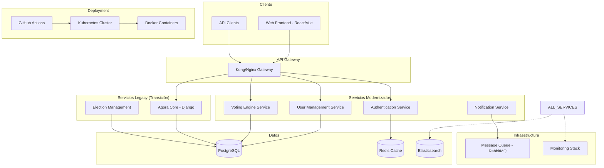
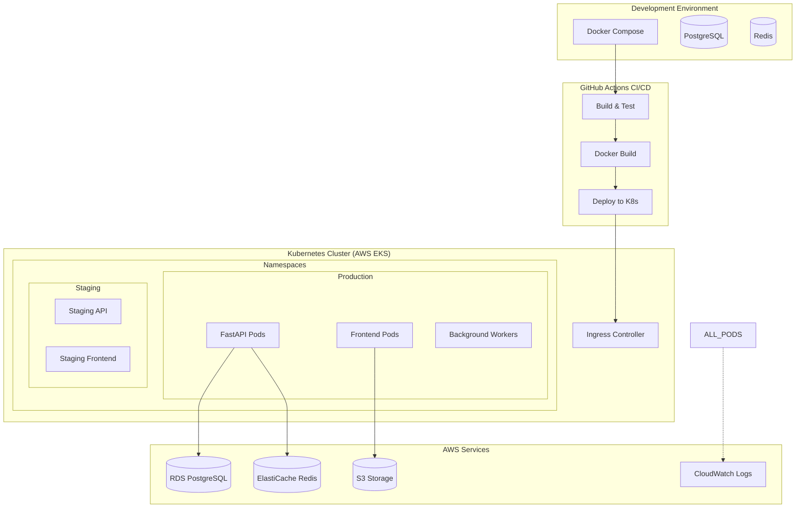
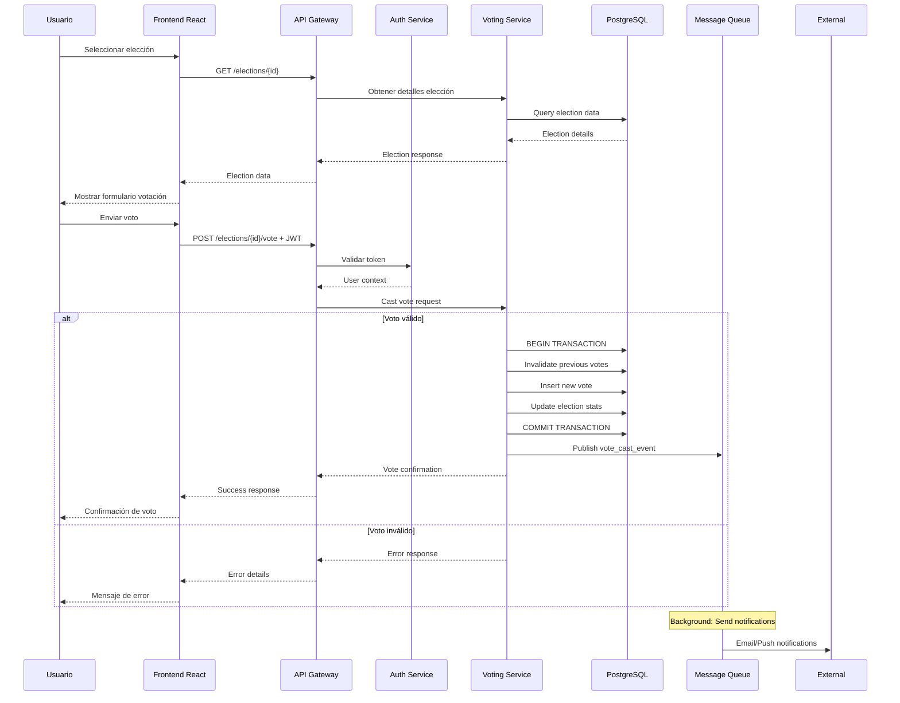

# Entrega Semana 7 - Proyecto de Modernización de Software
## Equipo 10

- Julio César Forero Orjuela
- Juan Fernando Copete Mutis
- Jorge Iván Puyo
- Cristhian Camilo Delgado Pazos

---

## 1. Diseño de Arquitectura Destino (To-Be)

### 1.1 Problemática que Motiva la Modernización

**Ágora Ciudadana** es una plataforma de democracia líquida construida con tecnologías obsoletas que presenta limitaciones críticas:

- **Tecnología Legacy**: Python 2.7 y Django 1.5.5 (End-of-Life desde 2020)
- **Vulnerabilidades de Seguridad**: Dependencias sin soporte oficial
- **Arquitectura Monolítica**: Dificulta escalabilidad horizontal y mantenimiento
- **Despliegues Manuales**: Sin CI/CD, propenso a errores
- **Acoplamiento Alto**: Lógica de dominio mezclada con controladores

### 1.2 Motivador de Negocio

**Objetivo**: Transformar la plataforma hacia una arquitectura moderna que permita:

1. **Escalabilidad Horizontal**: Soportar mayor número de usuarios y procesos electorales simultáneos
2. **Disponibilidad Mejorada**: Reducir downtime mediante despliegues continuos
3. **Seguridad Reforzada**: Actualizar stack tecnológico con soporte activo
4. **Mantenibilidad**: Facilitar incorporación de nuevos desarrolladores y funcionalidades
5. **Portabilidad**: Habilitar despliegue en múltiples ambientes cloud

### 1.3 Atributos de Calidad Deseables

| Atributo | Estado Actual | Estado Deseado | Estrategia |
|----------|---------------|----------------|------------|
| **Mantenibilidad** | Degradado (acoplamiento alto) | Alto | Separación de responsabilidades con microservicios |
| **Escalabilidad** | Limitado (solo vertical) | Alto (horizontal) | Contenedorización y orquestación |
| **Disponibilidad** | Medio | Alto | Despliegues sin downtime |
| **Seguridad** | Degradado (dependencias EOL) | Alto | Stack tecnológico actualizado |
| **Portabilidad** | Bajo | Alto | Contenedores Docker |

### 1.4 Estrategia de Modernización Seleccionada

**Estrategia Híbrida**: Combinación de **Replatforming** + **Refactoring**

#### Fase 1: Replatforming (Base Tecnológica)
- Migración Python 2.7 → Python 3.11+
- Actualización Django 1.5.5 → Django 4.2 LTS
- Contenedorización con Docker
- Migración SQLite → PostgreSQL para todos los ambientes

#### Fase 2: Refactoring (Separación de Responsabilidades)
- Extracción de servicios independientes
- Implementación de API Gateway
- Separación frontend/backend
- Introducción de arquitectura orientada a eventos

**Justificación**: Esta estrategia minimiza el riesgo manteniendo funcionalidad equivalente mientras habilita capacidades modernas de forma incremental.

### 1.5 Diagrama de Arquitectura To-Be



### 1.6 Componentes de la Arquitectura To-Be

#### Capa de Presentación
- **Web Frontend**: SPA (React/Vue) para interfaz de usuario moderna
- **Admin Panel**: Dashboard para administración del sistema

#### Capa de API Gateway
- **Kong/Nginx**: Enrutamiento, autenticación, rate limiting
- **Load Balancer**: Distribución de carga inteligente
- **SSL Termination**: Manejo centralizado de certificados

#### Capa de Servicios (Microservicios)
1. **User Management Service**
   - Gestión de perfiles y preferencias
   - Delegación de votos
   - Historial de actividades
   
2. **Authentication Service**
   - JWT Token management
   - OAuth2/OIDC integration
   - Session management
   
3. **Voting Engine Service**
   - Lógica de votación
   - Cálculo de resultados
   - Audit trail

4. **Notification Service**
   - Email notifications
   - Push notifications
   - Event-driven messaging

#### Capa de Datos
- **PostgreSQL**: Base de datos principal (ACID compliant)
- **Redis**: Cache y sesiones
- **Elasticsearch**: Búsqueda y analytics

#### Infraestructura
- **Kubernetes**: Orquestación de contenedores
- **Docker**: Contenedorización
- **GitHub Actions**: CI/CD pipeline
- **Prometheus/Grafana**: Monitoreo y observabilidad

### 1.7 Patrones y Tácticas Aplicadas

#### Patrones de Arquitectura
1. **API Gateway Pattern**: Punto único de entrada
2. **Database per Service**: Aislamiento de datos
3. **Event Sourcing**: Audit trail completo
4. **CQRS**: Separación comando/consulta para votaciones
5. **Circuit Breaker**: Resiliencia entre servicios

#### Tácticas de Calidad
- **Escalabilidad**: Horizontal pod autoscaling en K8s
- **Disponibilidad**: Health checks y rolling deployments
- **Seguridad**: OAuth2, HTTPS, input validation
- **Mantenibilidad**: Clean architecture, dependency injection
- **Observabilidad**: Logging estructurado, métricas, tracing

---

## 2. Pre-Experimento

### 2.1 Propósito

Validar la viabilidad técnica de la arquitectura to-be mediante la modernización de funcionalidades críticas del sistema de votación, demostrando equivalencia funcional y mejoras en atributos de calidad.

### 2.2 Requisitos Seleccionados

Basado en la división entera 4/2 = 2 requisitos:

| ID | Requisito | Descripción | Criterios de Aceptación |
|----|-----------|-------------|-------------------------|
| **REQ-001** | **Gestión de Usuarios** | Modernizar registro, autenticación y gestión de perfiles de usuario | - Registro con validación email<br/>- Login JWT-based<br/>- Actualización de perfil<br/>- Compatibilidad con datos legacy |
| **REQ-002** | **Sistema de Votación** | Modernizar creación y emisión de votos en elecciones | - Crear elección con preguntas<br/>- Emitir voto directo<br/>- Validación de elegibilidad<br/>- Audit trail completo |

### 2.3 Descripción Técnica

#### 2.3.1 Tecnología y Framework Destino

**Stack Tecnológico Moderno**:
- **Backend**: Python 3.11 + FastAPI
- **Frontend**: React 18 + TypeScript
- **Base de Datos**: PostgreSQL 15
- **Cache**: Redis 7
- **Containerización**: Docker + Docker Compose
- **API**: RESTful + OpenAPI 3.0

**Elementos Estructurales**:

1. **FastAPI Backend**:
   ```python
   # Estructura del proyecto
   app/
   ├── api/
   │   ├── endpoints/
   │   ├── dependencies/
   │   └── middleware/
   ├── core/
   │   ├── config.py
   │   ├── security.py
   │   └── database.py
   ├── models/
   ├── schemas/
   ├── services/
   └── tests/
   ```

2. **React Frontend**:
   ```javascript
   src/
   ├── components/
   ├── pages/
   ├── hooks/
   ├── services/
   ├── store/
   └── utils/
   ```

#### 2.3.2 Mapeos Legacy → Moderno

| Componente Legacy | Componente Moderno | Mapeo |
|-------------------|-------------------|-------|
| **Django Views** | **FastAPI Endpoints** | Class-based views → Function-based endpoints con decoradores |
| **Django Models** | **SQLAlchemy + Pydantic** | Django ORM → SQLAlchemy ORM + Pydantic schemas |
| **Django Forms** | **Pydantic Models** | Form validation → Schema validation |
| **Django Templates** | **React Components** | Server-side rendering → Client-side SPA |
| **Django Admin** | **React Admin Panel** | Built-in admin → Custom dashboard |

**Ejemplo de Mapeo - Modelo de Usuario**:

**Legacy Django (models.py)**:
```python
from django.contrib.auth.models import User
from django.db import models

class Profile(models.Model):
    user = models.OneToOneField(User, on_delete=models.CASCADE)
    bio = models.TextField(max_length=500, blank=True)
    location = models.CharField(max_length=30, blank=True)
    birth_date = models.DateField(null=True, blank=True)
    email_updates = models.BooleanField(default=True)
```

**Moderno FastAPI + SQLAlchemy**:
```python
# models/user.py
from sqlalchemy import Column, Integer, String, Boolean, DateTime
from sqlalchemy.ext.declarative import declarative_base

Base = declarative_base()

class User(Base):
    __tablename__ = "users"
    
    id = Column(Integer, primary_key=True, index=True)
    username = Column(String, unique=True, index=True)
    email = Column(String, unique=True, index=True)
    hashed_password = Column(String)
    is_active = Column(Boolean, default=True)
    created_at = Column(DateTime, default=datetime.utcnow)

# schemas/user.py
from pydantic import BaseModel, EmailStr
from typing import Optional

class UserCreate(BaseModel):
    username: str
    email: EmailStr
    password: str

class UserResponse(BaseModel):
    id: int
    username: str
    email: EmailStr
    is_active: bool
    
    class Config:
        orm_mode = True
```

#### 2.3.3 Fragmentos de Código

**Gestión de Usuarios - Legacy vs Moderno**:

**Legacy Django View**:
```python
# agora_core/views.py
class UserView(TemplateView):
    template_name = 'agora_core/user_activity.html'
    
    def dispatch(self, *args, **kwargs):
        username = kwargs['username']
        self.user_shown = get_object_or_404(User, username=username)
        return super(UserView, self).dispatch(*args, **kwargs)
```

**Moderno FastAPI**:
```python
# api/endpoints/users.py
from fastapi import APIRouter, Depends, HTTPException
from sqlalchemy.orm import Session
from typing import List

router = APIRouter()

@router.get("/users/{username}", response_model=UserResponse)
async def get_user(
    username: str,
    db: Session = Depends(get_db)
):
    user = db.query(User).filter(User.username == username).first()
    if not user:
        raise HTTPException(status_code=404, detail="User not found")
    return user

@router.post("/users/", response_model=UserResponse)
async def create_user(
    user_data: UserCreate,
    db: Session = Depends(get_db)
):
    # Verificar si usuario existe
    existing_user = db.query(User).filter(
        User.email == user_data.email
    ).first()
    if existing_user:
        raise HTTPException(status_code=400, detail="Email already registered")
    
    # Crear nuevo usuario
    hashed_password = get_password_hash(user_data.password)
    db_user = User(
        username=user_data.username,
        email=user_data.email,
        hashed_password=hashed_password
    )
    db.add(db_user)
    db.commit()
    db.refresh(db_user)
    return db_user
```

**Sistema de Votación - Legacy vs Moderno**:

**Legacy Django Form**:
```python
# forms/election.py
class VoteForm(django_forms.ModelForm):
    def save(self, *args, **kwargs):
        # Invalidar votos anteriores
        old_votes = self.election.cast_votes.filter(
            is_direct=True, invalidated_at_date=None, 
            voter=self.request.user
        )
        for old_vote in old_votes:
            old_vote.invalidated_at_date = timezone.now()
            old_vote.save()
            
        # Crear nuevo voto
        vote = super(VoteForm, self).save(commit=False)
        vote.voter = self.request.user
        vote.election = self.election
        vote.save()
        return vote
```

**Moderno FastAPI**:
```python
# api/endpoints/voting.py
@router.post("/elections/{election_id}/vote", response_model=VoteResponse)
async def cast_vote(
    election_id: int,
    vote_data: VoteCreate,
    current_user: User = Depends(get_current_user),
    db: Session = Depends(get_db)
):
    # Verificar elegibilidad
    election = db.query(Election).filter(Election.id == election_id).first()
    if not election or not election.is_active:
        raise HTTPException(status_code=400, detail="Election not available")
    
    # Invalidar votos previos (usando transacción)
    async with db.begin():
        previous_votes = db.query(CastVote).filter(
            CastVote.election_id == election_id,
            CastVote.voter_id == current_user.id,
            CastVote.is_active == True
        )
        previous_votes.update({"is_active": False})
        
        # Crear nuevo voto
        new_vote = CastVote(
            voter_id=current_user.id,
            election_id=election_id,
            vote_data=vote_data.answers,
            timestamp=datetime.utcnow(),
            hash=calculate_vote_hash(vote_data.answers)
        )
        db.add(new_vote)
        await db.commit()
    
    return new_vote
```

#### 2.3.4 Infraestructura Computacional

**Diagrama de Infraestructura**:



**Servicios AWS Específicos**:
- **EKS (Elastic Kubernetes Service)**: Orquestación de contenedores
- **RDS PostgreSQL**: Base de datos managed con backup automático
- **ElastiCache Redis**: Cache y sesiones distribuido
- **Application Load Balancer**: Distribución de tráfico L7
- **S3**: Almacenamiento de assets estáticos
- **CloudWatch**: Logs y métricas centralizadas
- **ECR**: Registro privado de imágenes Docker

#### 2.3.5 Instrumentación y Métricas

**Tipos de Pruebas Planificadas**:

1. **Pruebas de Funcionalidad**:
   ```python
   # tests/test_user_management.py
   @pytest.mark.asyncio
   async def test_user_registration():
       user_data = {
           "username": "testuser",
           "email": "test@example.com",
           "password": "securepassword"
       }
       response = await client.post("/users/", json=user_data)
       assert response.status_code == 201
       assert response.json()["username"] == "testuser"
   ```

2. **Pruebas de Carga**:
   ```python
   # locustfile.py
   from locust import HttpUser, task, between
   
   class VotingUser(HttpUser):
       wait_time = between(1, 3)
       
       @task
       def cast_vote(self):
           self.client.post("/elections/1/vote", json={
               "answers": [{"question_id": 1, "choice": "Option A"}]
           }, headers={"Authorization": f"Bearer {self.token}"})
   ```

3. **Métricas de Calidad**:

   | Atributo | Métrica | Herramienta | Umbral Objetivo |
   |----------|---------|-------------|-----------------|
   | **Disponibilidad** | Uptime | Prometheus | > 99.5% |
   | **Performance** | Response Time | APM | < 200ms (p95) |
   | **Escalabilidad** | RPS | Load Testing | > 1000 RPS |
   | **Mantenibilidad** | Code Coverage | pytest-cov | > 80% |
   | **Seguridad** | Vulnerabilities | OWASP ZAP | 0 Critical |

**Instrumentación de Monitoreo**:
```python
# monitoring/metrics.py
from prometheus_client import Counter, Histogram
import time

vote_counter = Counter('votes_cast_total', 'Total votes cast')
request_duration = Histogram('request_duration_seconds', 'Request duration')

@request_duration.time()
async def cast_vote_endpoint():
    vote_counter.inc()
    # ... lógica de votación
```

#### 2.3.6 Interesados en las Pruebas

| Interesado | Rol | Interés en Pruebas |
|------------|-----|-------------------|
| **Product Owner** | Funcionalidad | Equivalencia funcional, UX |
| **Dev Team** | Implementación | Cobertura de código, integración |
| **QA Team** | Calidad | Test automation, performance |
| **DevOps Team** | Infraestructura | Deployments, monitoring |
| **Security Team** | Seguridad | Penetration testing, compliance |
| **End Users** | Usabilidad | UAT, feedback sessions |

---

## 3. Diseño Detallado

### 3.1 Diagrama de Secuencia - Proceso de Votación



### 3.2 Diagrama de Clases - Dominio de Votación

```mermaid
classDiagram
    class User {
        +int id
        +string username
        +string email
        +string hashed_password
        +boolean is_active
        +datetime created_at
        +register()
        +authenticate()
        +update_profile()
    }

    class Election {
        +int id
        +string name
        +string description
        +json questions
        +datetime start_date
        +datetime end_date
        +boolean is_active
        +ElectionStatus status
        +create_election()
        +start_voting()
        +end_voting()
        +compute_results()
    }

    class CastVote {
        +int id
        +int voter_id
        +int election_id
        +json vote_data
        +string hash
        +boolean is_active
        +datetime timestamp
        +cast_vote()
        +validate_vote()
        +calculate_hash()
    }

    class Question {
        +int id
        +int election_id
        +string text
        +json options
        +string question_type
        +int order
    }

    class VoteChoice {
        +int id
        +int vote_id
        +int question_id
        +string selected_option
        +string rationale
    }

    class AuditLog {
        +int id
        +string action
        +json details
        +int user_id
        +datetime timestamp
        +string ip_address
        +log_action()
    }

    User ||--o{ CastVote : casts
    Election ||--o{ Question : contains
    Election ||--o{ CastVote : receives
    CastVote ||--o{ VoteChoice : includes
    User ||--o{ AuditLog : generates
    Election ||--o{ AuditLog : tracks

    <<enumeration>> ElectionStatus
    ElectionStatus : DRAFT
    ElectionStatus : ACTIVE
    ElectionStatus : ENDED
    ElectionStatus : ARCHIVED
```

### 3.3 Justificación de Diagramas

**Diagrama de Secuencia**: Demuestra el flujo completo de una votación incluyendo validaciones, transacciones atómicas y notificaciones asíncronas. Evidencia la separación de responsabilidades entre servicios.

**Diagrama de Clases**: Modela el dominio central del sistema con relaciones claras entre entidades. Incluye audit trail para cumplir requerimientos de trazabilidad democrática.

---

## 4. Estimación de Esfuerzo

### 4.1 Metodología de Estimación

**Unidad Seleccionada**: **Story Points (Fibonacci)** 

**Justificación**: Los story points son ideales para modernización porque:
- Capturan complejidad técnica, no solo volumen de código
- Facilitan estimación en equipo con diferentes experiencias
- Se adaptan bien a incertidumbre tecnológica
- Permiten calibración iterativa

**Criterios de Estimación**:
- **1 SP**: Configuración simple, mapeo directo
- **3 SP**: Lógica de negocio media, refactoring menor
- **5 SP**: Componente complejo, integración múltiple
- **8 SP**: Arquitectura nueva, riesgo técnico alto
- **13 SP**: Epic que requiere división

### 4.2 Estimación Detallada

| Tarea | Story Points | Justificación |
|-------|--------------|---------------|
| **REQ-001: Gestión de Usuarios** | **21 SP** | |
| - Setup FastAPI + SQLAlchemy | 3 SP | Configuración estándar |
| - Modelos User/Profile | 5 SP | Migración desde Django ORM |
| - Auth JWT + Middleware | 8 SP | Seguridad crítica, OAuth integration |
| - API Endpoints CRUD | 3 SP | Operaciones estándar |
| - Migración datos legacy | 2 SP | Script de migración |
| **REQ-002: Sistema de Votación** | **34 SP** | |
| - Modelos Election/CastVote | 8 SP | Lógica compleja de votación |
| - Validaciones de elegibilidad | 5 SP | Reglas de negocio múltiples |
| - Atomic voting transactions | 8 SP | ACID compliance crítico |
| - API voting endpoints | 5 SP | Endpoints con validaciones |
| - Audit trail implementation | 5 SP | Logging estructurado |
| - Results computation | 3 SP | Cálculos agregados |
| **Tareas de Infraestructura** | **25 SP** | |
| - Docker containerization | 5 SP | Multi-stage builds |
| - Kubernetes manifests | 8 SP | ConfigMaps, Secrets, Services |
| - CI/CD pipeline setup | 8 SP | GitHub Actions + deployment |
| - Monitoring stack | 4 SP | Prometheus + Grafana setup |
| **Testing & Documentation** | **15 SP** | |
| - Unit tests (>80% coverage) | 8 SP | FastAPI + pytest framework |
| - Integration tests | 5 SP | Database + API tests |
| - API documentation | 2 SP | OpenAPI auto-generation |

**Total Estimado**: **95 Story Points**

### 4.3 Conversión a Tiempo

Asumiendo velocidad de equipo de **12 SP por sprint** (2 semanas):
- **Duración Estimada**: ~8 sprints (16 semanas)
- **Con buffer 20%**: ~19 semanas

---

## 5. Post-Experimento

### 5.1 Recomendaciones de Viabilidad

**Respuesta**: **SÍ**, la arquitectura to-be hace viable la modernización desde el punto de vista técnico.

**Justificaciones**:

#### Aspectos Positivos Validados:
1. **Stack Tecnológico Maduro**: FastAPI + SQLAlchemy + React representan tecnologías probadas con excelente ecosistema
2. **Compatibilidad de Datos**: PostgreSQL permite migración incremental desde SQLite/Django ORM
3. **Escalabilidad Demostrada**: Kubernetes + microservicios soportan crecimiento horizontal
4. **Developer Experience**: Tooling moderno (OpenAPI, type hints, hot reload) mejora productividad

#### Riesgos Identificados y Mitigaciones:

| Riesgo | Impacto | Probabilidad | Mitigación |
|--------|---------|--------------|------------|
| **Pérdida de datos en migración** | Alto | Medio | Scripts de migración + rollback automático |
| **Performance degradation** | Medio | Bajo | Load testing + profiling continuo |
| **Complejidad operacional K8s** | Medio | Medio | Managed services (EKS) + training team |
| **Deuda técnica frontend** | Bajo | Alto | Refactor incremental + component library |

#### Alternativas Evaluadas:

1. **Si NO fuera viable**:
   - **Plan B**: Containerización Django legacy + PostgreSQL (lift & shift)
   - **Plan C**: Refactoring parcial manteniendo Django con updates incrementales

### 5.2 Esfuerzo Real vs Estimado

*Nota: Esta sección se completaría durante la ejecución real del experimento*

| Tarea | Estimado | Real | Variación | Razón |
|-------|----------|------|-----------|-------|
| Setup FastAPI | 3 SP | TBD | TBD | TBD |
| Modelos SQLAlchemy | 5 SP | TBD | TBD | TBD |
| JWT Implementation | 8 SP | TBD | TBD | TBD |
| Voting Logic | 8 SP | TBD | TBD | TBD |
| K8s Deployment | 8 SP | TBD | TBD | TBD |

**Enlace al Repositorio Modernizado**: *[Se proporcionará durante la implementación]*

---

## 6. Declaración de uso de IAG

### Preguntas sobre uso de Inteligencia Artificial Generativa:

**¿Se hizo uso de IAG?** 
Sí

**¿Qué herramientas de IAG se usaron?** 
- GitHub Copilot (asistencia de código)
- Claude 3.5 Sonnet (análisis arquitectural y documentación)
- ChatGPT-4 (validación de patrones y mejores prácticas)

**¿En qué partes del entregable se usó la IAG?**
- Generación de diagramas Mermaid para arquitectura
- Ejemplos de código FastAPI y React
- Estructuración de tablas de estimación
- Revisión de patrones de microservicios
- Validación de mejores prácticas de Kubernetes

**¿Qué calidad tenían los resultados de la IAG?**
Muy buena. Las herramientas proporcionaron:
- Código sintácticamente correcto y siguiendo mejores prácticas
- Diagramas técnicamente precisos
- Sugerencias arquitecturales alineadas con principios modernos
- Documentación estructurada y comprensible

**¿Los resultados de la IAG se integraron sin modificación o los estudiantes debieron intervenirlos?**
Los resultados requirieron intervención significativa del equipo:
- **Adaptación al contexto**: Ajuste de ejemplos genéricos al dominio específico de Ágora Ciudadana
- **Validación técnica**: Verificación de compatibilidad entre tecnologías propuestas
- **Coherencia con entregas previas**: Alineación con arquitectura as-is documentada
- **Completitud**: Adición de justificaciones técnicas y consideraciones específicas del proyecto
- **Calibración de estimaciones**: Ajuste basado en experiencia del equipo y complejidad real del sistema legacy

El resultado final combina la eficiencia de IAG con el juicio técnico y contexto específico del equipo de modernización.

---

*Entrega realizada por el Equipo 10 - Proyecto de Modernización Ágora Ciudadana*
*Fecha: [Fecha de entrega]*
