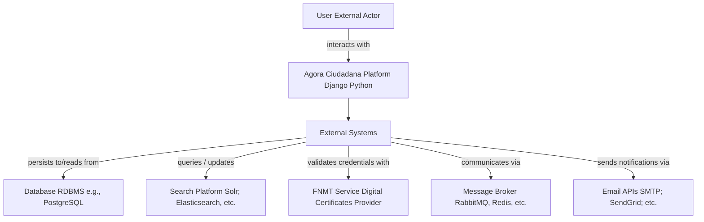
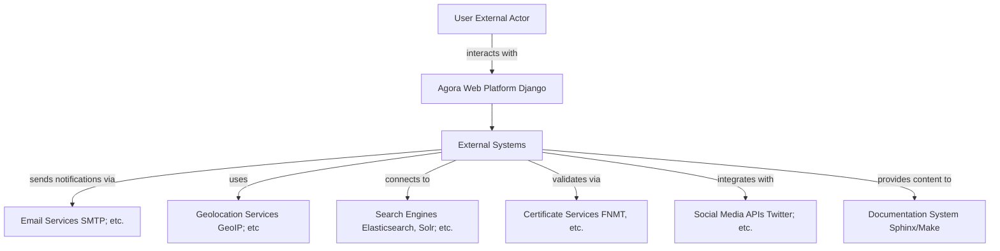
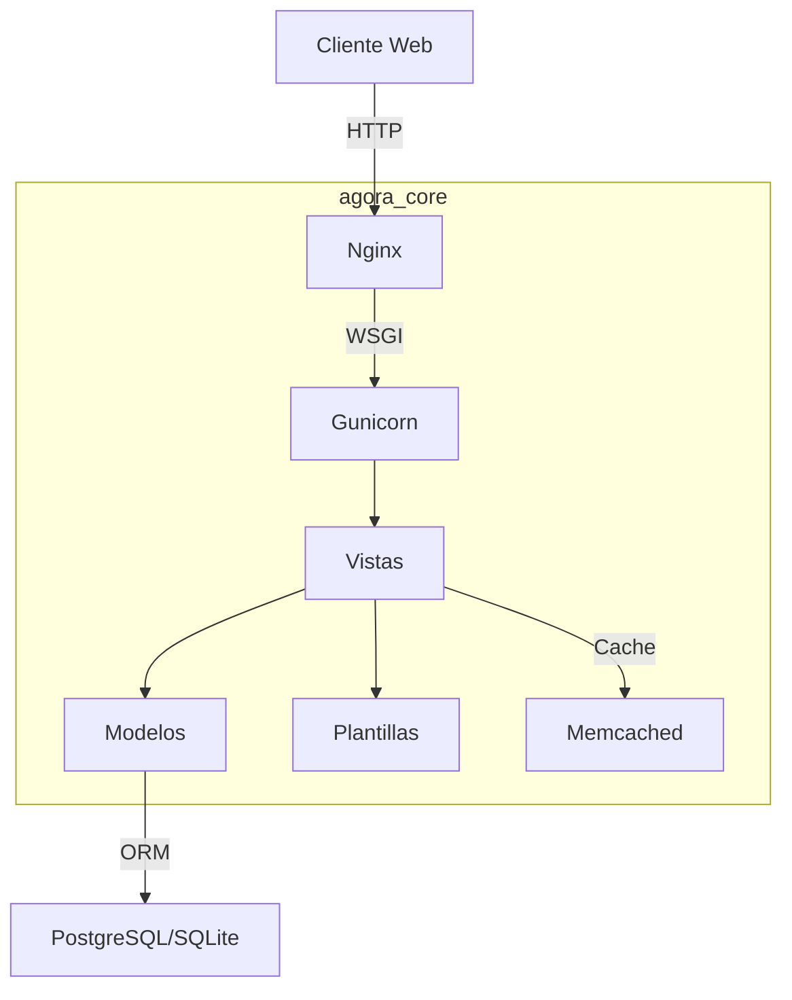
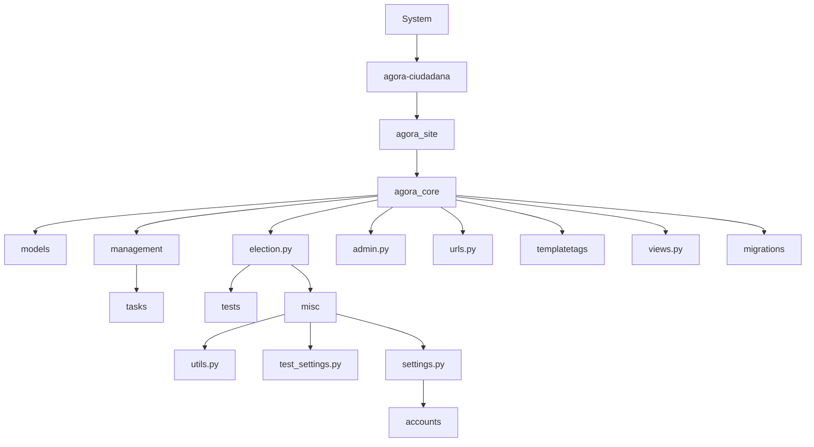
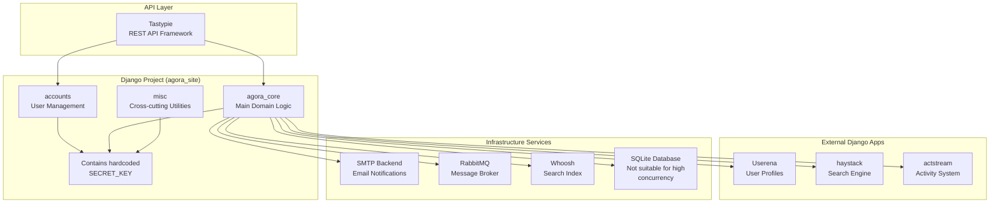

# Archivos Consolidados

*Consolidación de 4 archivos markdown*


---

## Entrega Semana 2 AQL.md


# Proyecto de Modernización de Software - Semana 2

## Equipo 10
- Julio César Forero Orjuela
- Juan Fernando Copete Mutis
- Jorge Iván Puyo
- Cristhian Camilo Delgado Pazos

## 1 Motivación de la modernización

Ágora Ciudadana, plataforma de democracia líquida, fue construida con Python 2.7 y Django 1.5.5 (fin de vida en 2020). Esto genera vulnerabilidades de seguridad, altos costos de mantenimiento y una arquitectura monolítica difícil de escalar. El objetivo es modernizar Parte del software y sus funcionalidades, no sólo migrar infraestructura, para:

1. Permitir despliegues continuos mediante contenedores (Docker/Kubernetes).
2. Experimentar con funcionalidades que permitan implementar arquitecturas basadas en microservicios y despliegue en AWS.
3. Facilitar la contribución de nuevos desarrolladores eliminando dependencias obsoletas.
4. Habilitar escalabilidad horizontal y resiliencia.

## 2 Entendimiento del legado

### 2.1 Tecnología legada

| Categoría               | Detalles                                                        |
| ----------------------- | --------------------------------------------------------------- |
| Lenguaje / Framework    | Python 2.7 (EOL) / Django 1.5.5                                 |
| Patrón arquitectónico   | MVT (Model-View-Template)<br/>(geeksforgeeks.org)               |
| Paquetes clave          | userena, haystack (Whoosh), actstream                           |
| Infraestructura         | Nginx → Gunicorn (WSGI) → Aplicación; despliegue bare-metal/VPS |
| Base de datos           | SQLITE / PostgreSQL                                             |
| Caché                   | Memcached                                                       |
| Gestión de dependencias | requirements.txt                                                |


Principales características y limitaciones:

- Dependencias sin soporte oficial → riesgo de seguridad.
- Monolito dificulta la incorporación de microservicios y pruebas independientes.
- Despliegues manuales, sin CI/CD.
- Escalabilidad sólo vertical.

---


## 2.2 Arquitectura de la tecnología legada

### Modelo de 3 capas de la aplicación





La arquitectura MVT separa datos, lógica y presentación, pero en versiones antiguas de Django todo reside en un mismo repositorio y proceso. Su flujo estándar es:

---




Descripción de elementos:

- Modelos: mapeo ORM entre objetos Python y tablas PostgreSQL/SQLite.
- Vistas: funciones/clases que orquestan la lógica de negocio y devuelven _responses_.
- Plantillas: archivos HTML con _tags_ de Django renderizados en servidor.
- WSGI: interfaz que conecta servidores (Gunicorn) con Django.

Aunque MVT facilita pruebas unitarias, la ausencia de una capa de servicios independiente hace que la lógica de dominio se combine con controladores, incrementando el acoplamiento.

## 3 Aplicación de ejemplo

---


| Aspecto                     | Información                                                                                                                                                                                                  |
| --------------------------- | ------------------------------------------------------------------------------------------------------------------------------------------------------------------------------------------------------------ |
| Nombre                      | Ágora Ciudadana                                                                                                                                                                                              |
| Repositorio                 | https\://github.com/agoravoting/agora-ciudadana                                                                                                                                                              |
| Tamaño                      | ≈ 31 k líneas de código (contando .py, .js, .html)                                                                                                                                                           |
| Dominio                     | Democracia líquida, procesos de votación ciudadana                                                                                                                                                           |
| Funcionalidades principales | • Gestión de usuarios y delegación de voto<br/>• Creación de ágoras y procesos electorales<br/>• Publicación de propuestas y candidaturas<br/>• API REST básica<br/>• Historial de actividades (audit trail) |


Cobertura de requisitos del curso

- > 2000 líneas.
- Compila y se ejecuta; funcionalidad comprobada con ./runtests.sh.
- Repositorio público;

## Repositorio

Original:
agoravoting/agora-ciudadana: Liquid Voting system made with python and django

Fork:

JulioCesarForero/agora-ciudadana: Liquid Voting system made with python and django

Ejecución: el repositorio incluye un script provision/docker-compose.yml que permite levantar
los servicios en contenedores (PostgreSQL, RabbitMQ, Celery, Django). Las instrucciones se
verificaron en Ubuntu 22.04 con Docker 24.0.

## 4 Declaración de uso de IAG

---

# Uso de Inteligencia Artificial Generativa (IAG)

Para todas las actividades evaluativas (excepto el examen final) se permite el uso de herramientas de IAG. Si se usan se debe incluir en el entregable una sección en donde se respondan las siguientes preguntas:

- ¿Se hizo uso de IAG? SI
- ¿Qué herramientas de IAG se usaron? Notebooklm, OpenIA, CloudSonet
- ¿En qué partes del entregable se usó la IAG? Se hace uso de la la herramienta como forma de estudio para interpretar, entender, estudiar y repasar el material de estudio. Particularmente en el entregable la usé para construir las respuestas de similitudes y diferencias.
- ¿Qué calidad tenían los resultados de la IAG? Buena
- ¿Los resultados de la IAG se integraron sin modificación o los estudiantes debieron intervenirlos? Siempre se corroboran y ajustan las respuestas que brindan los modelos y herramientas de IAG buscando combinar las respuestas que da junto con el propio conocimiento, entendimiento y experiencia, debatiendo con el equipo y agregando contenido o eliminándolo según lo considerado como verdadero y que podamos sustentar.

---

NO_CONTENT_HERE


*--- Fin de Entrega Semana 2 AQL.md ---*

---

## Entrega Semana 4 Actividad Padlet Grupo 10.md


# Número del grupo: 10

# Nombres de los miembros del grupo

- Julio César Forero Orjuela
- Juan Fernando Copete Mutis
- Jorge Iván Puyo
- Cristhian Camilo Delgado Pazos

## Artículo escogido

L3 – Modernize Mainframe Workloads to AWS with Astadia Automated Refactoring

## Motivación del proyecto

Ágora Ciudadana, plataforma de democracia líquida, fue construida con Python 2.7 y Django 1.5.5 (EOL 2020). Esto genera vulnerabilidades, despliegues manuales y un monolito difícil de escalar. La modernización busca:

1. Habilitar despliegues continuos mediante contenedores.
2. Desacoplar funcionalidades hacia microservicios y serverless en AWS.
3. Reducir costos operativos y dependencias obsoletas.
4. Lograr escalabilidad horizontal y resiliencia.

## Mejora de Calidad del Software (Twelve-Factor Compliance)

La aplicación incumple principios fundamentales del modelo Twelve-Factor App, incluyendo:

- Configuraciones sensibles embebidas en código (SECRET_KEY, SMTP).
- Uso de SQLite en producción
- Cache deshabilitado.
- Ausencia de logging estructurado.
- Y ausencia de contenedorización, lo cual dificulta la portabilidad, pruebas consistentes y el despliegue automatizado.

Adoptar contenedores mediante Docker permitirá cumplir con:

- Factor X (Paridad Dev/Prod): Entornos consistentes.
- Factor V (Build/Release/Run): Separación clara del ciclo de vida de despliegue.

## Ventaja Competitiva y Nuevas Oportunidades

Al modularizar y dockerizar la gestión de usuarios:

- Se habilitan nuevas integraciones externas, como SSO.
- Se reduce el tiempo de onboarding de nuevos desarrolladores.
- Se establecen bases para una arquitectura escalable y portable, facilitando pruebas automatizadas y despliegues en múltiples ambientes (on-premise, nube, CI/CD).

## Problemáticas en común entre el artículo y el proyecto del equipo

- Tecnología legacy y escasez de talento: el artículo parte de COBOL/IDMS; Ágora depende de Python 2 sin soporte.
- Monolito de gran tamaño que dificulta cambios rápidos y pruebas.
- Costos y riesgos de operar sobre infraestructura antigua.
- Necesidad de automatizar pruebas y despliegues para garantizar equivalencia funcional durante la migración.

## Estrategia de modernización usada en el artículo y justificación

El artículo describe una Migración (Code Translation) 100 % automatizada con herramientas Astadia (CodeTurn/DataTurn) que:

- Convierten código y datos a lenguajes cloud-ready (Java/C#) y Amazon Aurora.
- Despliegan la aplicación moderna en Amazon EKS usando contenedores.
- Orquestan un pipeline Jenkins que ejecuta conversión, build, despliegue y testing continuo en AWS.
- Integran pruebas automatizadas (TestMatch/DataMatch) para validar equivalencia batch y online.

Justificación para Ágora: este enfoque minimiza la congelación del sistema y garantiza funcionalidad idéntica antes y después del cambio, reduciendo riesgo mientras habilita un stack moderno (Kubernetes, Aurora, Redis, observabilidad AWS).

## Lista de ideas extrapolables al proyecto Ágora Ciudadana

1. Pipeline de refactorización automática: crear jobs en Jenkins/GitHub Actions que corran pruebas de regresión tras cada conversión de Python 2 → Python 3/Django 4.
2. Conversión por lotes + sincronización incremental: aplicar ciclos Convert-Test-Tune sobre módulos Django (apps) para evitar congelar toda la plataforma.
3. Despliegue en Kubernetes (Amazon EKS): empaquetar el monolito actualizado como contenedor y habilitar rolling updates y autoscaling.
4. Suite de pruebas equivalentes: capturar interacciones clave (REST, formularios) y compararlas contra la versión legacy usando herramientas de snapshot testing.
5.  Migración de base de datos a Amazon Aurora con réplicas de lectura para escalar consultas.
6.  Observabilidad unificada: usar Amazon CloudWatch + Prometheus/Grafana para métricas del clúster y la aplicación, replicando el stack de referencia de Astadia.
7.  Política de freeze mínima: sincronizar cambios del repositorio principal con la rama de migración hasta semanas antes del go-live, reduciendo disrupción.
8.  Normalización progresiva del modelo de datos: tras la migración funcional, refactorizar esquemas para mejorar mantenibilidad sin romper equivalencia inicial.

---

*--- Fin de Entrega Semana 4 Actividad Padlet Grupo 10.md ---*

---

# Entrega Semana 4 Grupo 10.md

Proyecto de Modernización de Software – Semana 4

Equipo 10

- Julio César Forero Orjuela
- Juan Fernando Copete Mutis
- Jorge Iván Puyo
- Cristhian Camilo Delgado Pazos

## 1. Justificación de la elección de la herramienta de cartografía, puede ser una herramienta de cartografía nueva o de una de las herramientas empleadas en el curso

CodeScene: Esta herramienta proporciona una visualización detallada del estado del repositorio. Permite identificar archivos con alta frecuencia de cambios, analizar la complejidad y salud del código, y detectar áreas críticas que podrían representar deuda técnica. Además, cuenta con un panel interactivo que permite aplicar filtros y visualizar agrupamientos (clustering), facilitando la comprensión de la estructura del sistema y apoyando la toma de decisiones estratégicas para la refactorización.

Claude 4-sonet: Mediante el uso de prompts bien formulados, esta herramienta posibilita un análisis ágil de la arquitectura del sistema, la identificación de deudas técnicas y la sugerencia de módulos candidatos para modernización. La capacidad conversacional del modelo permite integrar conocimientos adquiridos en el curso para enriquecer el análisis, haciendo de esta una herramienta útil para alinear la evaluación técnica con los objetivos académicos y de modernización.

## 2. Listado de preguntas que se desean responder como parte de la comprensión del legado. Mínimo 3 preguntas de la dimensión de arquitectura y 3 de la de mantenibilidad

### Arquitectura:

1. ¿Cuántas aplicaciones del proyecto existen?
2. ¿Qué componente concentra la mayor cantidad de acceso a datos?
3. ¿Cuáles son los componentes funcionales del proyecto?
4. ¿Cuál es la estrategia de escalabilidad de la aplicación?
5. ¿Qué estrategia de caching existe y donde se implementan?

### Mantenibilidad:

1. ¿Cuántos modelos de datos existen y cuáles son?

2. ¿Qué clase/modelo es referenciado por mayor cantidad de archivos?

3. ¿Qué componentes de las vistas de Django tienen más líneas de código y responsabilidades?

4. ¿Existe endtrypoints que ya no se utilizan, código zombie?

5. ¿Qué dependencias existen entre las Django apps del proyecto?

## 3. Respuestas a las preguntas planteadas:

### Arquitectura

#### ¿Cuántas aplicaciones del proyecto existen?

Se evidencias 5 aplicaciones del proyecto:

- Actstream: Seguimiento de actividades
- Userena: sistema de perfiles extendido
- Haystack: Motor de búsqueda
- agota-core: Core del negocio
- accounts: Gestión de cuentas

#### ¿Que componente concentra la mayor cantidad de acceso a datos?

Este es el archivo agora_core/views.py, con un tamaño de 1,683 LOC y con un total de 17 operaciones de guardado.

| System                   | agora-ciudadana > agora\_site > agora\_core > views.py |
| ------------------------ | ------------------------------------------------------ |
| Low development activity | Hotspot                                                |


| Code health range | 10.0                               |
| ----------------- | ---------------------------------- |
| Commit threshold  |                                    |
| Combined aspects  | Hotspots \| Code Health \| Defects |
|                   | views.py                           |
|                   | 6.15 Problematic                   |
|                   | Code Health                        |


| Review           | Source Code                 | X-Ray           |
| ---------------- | --------------------------- | --------------- |
| Metrics          | Complexity Trend            | Change Coupling |
| Commits          | 17 commits                  |                 |
| Size             | 1,683 Lines of Code         |                 |
| Main Author      | Eduardo Robles Elvira (98%) |                 |
| Knowledge        | Code in former contributor  |                 |
| Development Cost |                             |                 |
| Modified         | 17 months ago               |                 |


#### ¿Cuales son los componentes funcionales del proyecto?

Gestion de agoras: /agora_core/models/agora.py y agoras /agora_core/resources/agora.py

- Crear y administrar ágoras
- Gestión de membresías
- Gestión de administradores

Sistema de electoral: agora_core/models/election.py, agora_core/resources/election.py

- Creación y configuración de elecciones
- Flujo de vida electoral (crear -> aprobar -> congelar -> iniciar -> terminar -> archivar)
- Computo de resultados y delegaciones

#### Sistema de votación

agora_core/models/castvote.py, agora_core/models/voting_systems/

- Emisión de votos directos
- Sistema de delegación de votos
- Conteo
- Verificación de criptografía

#### Gestión de usuarios: 
accounts/, userena/, agora_core/resources/user.py

- Registro y activación de usuarios
- Perfiles de usuario extendidos
- Gestión y configuración personales

#### Sistema de permisos

- Permisos granulares por objeto (Django-guardián)
- Control de acceso basado en roles

#### Sistema de actividad social
actstream/

- Stream actividades en tiempo real
- Sistema de seguimiento
- Notificación de acciones

#### Sistema de búsqueda
actstream/

- Indexación de ágoras, elecciones y usuarios
- Motor de búsqueda full-text
- Filtros y facetas

#### ¿Cuál es la estrategia de escalabilidad de la aplicación?

Actualmente la estrategia de escalabilidad es muy limitada, presentando los
siguientes problemas:

• SQLite: base de datos de archivo único, No escalable
• Sin conexiones concurrentes: bloqueos frecuentes bajo carga
• Sin replicación
• Sin particionamiento: toda la data en un archivo

```
# settings.py - Configuración actual
DATABASES = {
    'default': {
        'ENGINE': 'django.db.backends.sqlite3',
        'NAME': 'data/db.sqlite',
        # SQLite = SINGLE FILE DATABASE ❌
    }
}
```

configuración de la aplicación en Django

¿Qué estrategia de caching existe y donde se implementan?

El sistema tiene una estrategia de caching implementada pero esta desactivada
ya que tiene un cache de 0 segundos.

---


```python
# agora_site/settings.py
# Cache comentado para desarrollo
#CACHES = {
    #'default': {
        #'BACKEND': 'django.core.cache.backends.dummy.DummyCache',
    #}
#}

# Todas las configuraciones de tiempo en CERO
CACHE_MIDDLEWARE_SECONDS = 0  # ❌ Sin cache de middleware
MANY_CACHE_SECONDS = 0        # ❌ Sin cache para datos frecuentes
FEW_CACHE_SECONDS = 0         # ❌ Sin cache para datos críticos
```

Configuración global de chache

```python
# agora_site/agora_core/resources/election.py
@cache_control(s_max_age=settings.MANY_CACHE_SECONDS)  # @ Actualmente = 0
def get_all_votes(self, request, **kwargs):
    """Obtener todos los votos de una elección"""

@cache_control(s_max_age=settings.MANY_CACHE_SECONDS)
def get_cast_votes(self, request, **kwargs):
    """Obtener votos emitidos"""

@cache_control(s_max_age=settings.MANY_CACHE_SECONDS)
def get_delegated_votes(self, request, **kwargs):
    """Obtener votos delegados"""
```

Cache en los endpoints

## Mantenibilidad

¿Cuántos modelos de datos existen, cuales son?

Existen 8 modelos de datos distribuidos de la siguiente manera:

| App         | Modelos   | Archivos   |
| ----------- | --------- | ---------- |
| Agora\_core | 5 modelos | 5 archivos |
| userena     | 2 modelos | 1 archivo  |
| actstream   | 2 modelos | 1 archivo  |
| haystack    | 1 modelo  | 1 archivo  |


---

# ¿Qué clase/modelo es referenciado por mayor cantidad de archivos?

El modelo más referenciado es User con un total de 91 archivos que lo llaman, este modelo es importante para la autenticación, el segundo modelo más llamado es Election este es un modelo de negocio y es llamado en 40 archivos, esto se traduce en una posibilidad de alto acoplamiento y punto único de falla.

---




| Metric | Value |
|--------|-------|
| Code Health | 4.87 Problematic |
| Comments | 0 comments / 1 year |
| Lines of Code | 647 Lines |
| Main Author | Eduardo Robles Elvira (97%) |
| Knowledge | 97% code by former contributors |
| Modified | 17 months ago |

¿Qué componentes de las vistas de Django tienen más líneas de código y responsabilidades?

Esta pregunta se pasó por el modelo claude-4-sonnet y usando la herramienta CodeScene para rectificar, las responsabilidades que tiene la vista son:

- AgoraView - Vista principal de ágora
- AgoraBiographyView - Biografía de ágora
- AgoraElectionsView - Lista de elecciones de ágora
- AgoraMembersView - Gestión de miembros de ágora
- AgoraCommentsView - Comentarios de ágora
- AgoraAdminView - Administración de ágora
- AgoraListView - Lista todas las ágoras
- CreateAgoraView - Crear nueva ágora
- AgoraPostCommentView - Publicar comentarios en ágora

---


# RANKING DE VISTAS POR LÍNEAS DE CÓDIGO

| Posición | Archivo              | LOC   | Clases | Funciones | Promedio LOC   |
| -------- | -------------------- | ----- | ------ | --------- | -------------- |
| 🥇 1°    | agora\_core/views.py | 2,169 | 49     | 2         | 44 LOC/clase   |
| 🥈 2°    | userena/views.py     | 854   | 2      | 10        | 85 LOC/función |
| 🥉 3°    | umessages/views.py   | 272   | \~8    | \~15      | \~18 LOC/comp  |
| 4°       | haystack/views.py    | 234   | 2      | 2         | 58 LOC/comp    |
| 5°       | accounts/views.py    | 115   | 5      | 0         | 23 LOC/clase   |
| 6°       | actstream/views.py   | 109   | \~3    | \~5       | \~14 LOC/comp  |


## 🏆 ANÁLISIS DETALLADO DEL GANADOR: agora_core/views.py

📊 MÉTRICAS CRÍTICAS:

- 2,169 líneas de código (⚠️ CRÍTICO: 4x más grande que el siguiente)
- 49 clases Django (CBV - Class Based Views)
- Solo 2 funciones (FBV - Function Based Views)
- Violación del principio SRP: Una vista = Una responsabilidad

## Respuesta del modelo

[La imagen muestra una visualización de código en CodeScene para el archivo views.py en el sistema agora-ciudadana/agora_site/agora_core. La visualización es un diagrama de burbujas que representa diferentes componentes del código, con círculos de varios tamaños y colores indicando diferentes métricas como complejidad y salud del código.]

## Validación en CodeScene

[La imagen muestra detalles adicionales del análisis de CodeScene para el archivo views.py, incluyendo métricas como actividad de desarrollo, salud del código, y estadísticas de commits.]

---

# 4. Degradación de atributos de calidad.

Durante el proceso de cartografía y análisis del sistema legado se identificaron múltiples atributos de calidad que han sido comprometidos con el paso del tiempo. Estas degradaciones impactan directamente la capacidad del sistema para evolucionar, escalar y mantenerse seguro en entornos actuales.

# Seguridad:

Se encontró la clave secreta SECRET_KEY hardcodeada directamente en el archivo settings.py, una mala práctica crítica que puede comprometer la integridad de sesiones y tokens de autenticación. Además, el uso de un backend SMTP inseguro y la activación del modo DEBUG = True en producción exponen vulnerabilidades OWASP, aumentando el riesgo de ataques.

# Mantenibilidad:

El modelo User es referenciado en al menos 91 archivos, generando un alto nivel de acoplamiento. Este acoplamiento hace difícil modificar o extender la lógica de usuarios sin romper otras partes del sistema, lo cual ralentiza el desarrollo.

# Escalabilidad:

El sistema utiliza SQLite como base de datos principal, lo que limita el acceso concurrente, impide escalar horizontalmente y representa un cuello de botella. Adicionalmente, el sistema tiene desactivado el mecanismo de cacheo (CACHE_MIDDLEWARE_SECONDS = 0), lo que degrada el rendimiento en ambientes de carga media o alta.

# Cumplimiento con los principios Twelve-Factor App:

Se evidencian violaciones directas a factores esenciales:

- III - Config: Uso de valores sensibles embebidos en código.
- IV - Backing Services: SQLite en lugar de un servicio conectable como PostgreSQL.
- XI - Logs: Ausencia de recolección centralizada de logs para monitoreo y depuración.

Estas condiciones justifican la necesidad de una modernización dirigida que priorice la seguridad, el desacoplamiento del módulo de usuarios, y la incorporación de prácticas modernas que aseguren la sostenibilidad técnica del sistema en el mediano plazo.

---


| Atributo          | Evidencia                                            | Severidad  |
| ----------------- | ---------------------------------------------------- | ---------- |
| Seguridad         | SECRET\_KEY hardcodeado, SMTP inseguro, DEBUG = True | Crítica    |
| Mantenibilidad    | Modelo User acoplado a 91 archivos                   | Crítica    |
| Escalabilidad     | SQLite y cache deshabilitado                         | Alta       |
| Cumplimiento 12FA | Violaciones a factors III, IV, XI                    | Media-Alta |


# Estrategia de Modernización y Alcance

## 1. Motivadores de Negocio.

### Mejora de Calidad del Software (Twelve-Factor Compliance)

La aplicación incumple principios fundamentales del modelo Twelve-Factor App,
incluyendo:

- Configuraciones sensibles embebidas en código (SECRET_KEY, SMTP).
- Uso de SQLite en producción.
- Cache deshabilitado.
- Ausencia de logging estructurado.
- Y ausencia de contenedorización, lo cual dificulta la portabilidad, pruebas
consistentes y el despliegue automatizado.
  Adoptar contenedores mediante Docker permitirá cumplir con:
- Factor X (Paridad Dev/Prod): Entornos consistentes.
- Factor V (Build/Release/Run): Separación clara del ciclo de vida de
despliegue.

### Ventaja Competitiva y Nuevas Oportunidades

Al modularizar y dockerizar la gestión de usuarios:

- Se habilitan nuevas integraciones externas, como SSO.
- Se reduce el tiempo de onboarding de nuevos desarrolladores.

---


# 2. Alcance de la Estrategia de modernización.

Se establecen bases para una arquitectura escalable y portable, facilitando pruebas automatizadas y despliegues en múltiples ambientes (on-premise, nube, CI/CD).

# Acciones específicas:

- Refactorización + Wrapping
- Extraer accounts/ y userena/ como módulo desacoplado.
- Exponer API REST con autenticación JWT y base para SSO.
- Externalización de configuración
- Mover SECRET_KEY, claves SMTP y otras variables a entorno.
- Eliminar valores sensibles del código (settings.py).
- Dockerización
- Crear Dockerfile y docker-compose.yml para ambiente local y desarrollo.
- Usar PostgreSQL como base externa conectable (Twelve-Factor IV).
- Establecer procesos reproducibles (Twelve-Factor V y X).
- Análisis estático
- Integrar SonarQube o herramienta equivalente como parte del ciclo de integración continua.
- Automatizar validaciones de calidad y seguridad en cada cambio.

Esta estrategia permite desacoplar, asegurar y contenerizar progresivamente el sistema sin comprometer su funcionalidad actual, sentando las bases para fases posteriores de modernización.


---


# Diagrama de Componentes



El diagrama anterior, generado con Mermaid, permite evidencia de forma gráfica los componentes a trabajar en la modernización.

## Tabla de funcionalidades Priorizadas

---


| ID | Funcionalidad              | Descripción                                     | Criterios de Aceptación                            |
| -- | -------------------------- | ----------------------------------------------- | -------------------------------------------------- |
| F1 | Users API                  | API CRUD de usuarios con JWT                    | Login funcional, documentación, pruebas unitarias  |
| F2 | Externalización config     | Usar variables de entorno para secretos         | No hay secretos en código, validación en CI        |
| F3 | Análisis estático continuo | Integración con SonarQube o Bandit              | Métricas visibles, errores de seguridad reportados |
| F4 | Dockerización              | Crear contenedores para desarrollo y despliegue | Dockerfile y docker-compose.yml funcionales        |


## Uso de Inteligencia Artificial Generativa (IAG)

Se hizo uso de IAG en varias partes del entregable.

Se utilizaron principalmente Claude 4-Sonnet y GitHub Copilot.

Claude fue empleado para estructurar las respuestas de arquitectura y mantenibilidad, validar conceptos del sistema legado, y proponer una estrategia de modernización ajustada al alcance del equipo.

Copilot se utilizó opcionalmente para generar prompts técnicos y diagramas en Mermaid.

Los resultados obtenidos fueron de alta calidad, pero requerían validación manual y ajustes por parte del equipo. Las salidas generadas por la IAG fueron integradas con criterio técnico, evitando errores comunes como alucinaciones o suposiciones incorrectas. En todos los casos, la IAG se usó como complemento para acelerar y enriquecer el análisis técnico, no como reemplazo del criterio del equipo.


*--- Fin de Entrrega Semana 4 Grupo 10.md ---*

---

## Semana 5 Aplicación de patrones de modernización Grupo 10.md


# Ejemplo de aplicación de patrones de modernización Semana 5

- Número del grupo: 10

- Nombres de los miembros del grupo
  o Julio César Forero Orjuela
  o Juan Fernando Copete Mutis
  o Jorge Iván Puyo
  o Cristhian Camilo Delgado Pazos

## Principales similitudes y diferencias identificadas

| Dimensión                            | Coincidencias clave                                                                                                                            | Diferencias clave                                                                                                                                                                                                                                                                                                                                                                                                                                                       |
| ------------------------------------ | ---------------------------------------------------------------------------------------------------------------------------------------------- | ----------------------------------------------------------------------------------------------------------------------------------------------------------------------------------------------------------------------------------------------------------------------------------------------------------------------------------------------------------------------------------------------------------------------------------------------------------------------- |
| Punto de partida: entender el legado | Ambos enfoques comienzan por obtener una fotografía fiel del sistema tal como está ("as-is") y de los resultados que se persiguen del negocio. | El artículo de Thoughtworks lo plantea como un paso preliminar ("Understand the outcomes") de alcance amplio.<br/><br/>El curso lo desglosa en actividades formales de ingeniería inversa apoyadas en herramientas de cartografía como CodeScene y AQL.                                                                                                                                                                                                                 |
| Estrategia incremental               | Coinciden en evitar "big-bang" y promover migraciones graduales (Strangler, Branch-by-Abstraction, refactorización incremental)                | El curso baja la estrategia a un plan métododico paso a paso con entregables desde el entendimiento del sistema AS-IS además de (alcances, experimentos, transformaciones), mientras que el artículo se centra en patrones de arquitectura que dominan en esta clase de proyecto de desplazamiento sin necesariamente un entregable de artefactos de base, aunque si se muestran vistas de arquitectura de alto nivel que permiten la comprensión del patrón a aplicar. |
| Motivadores                          | Reducir costo del cambio, eliminar                                                                                                             | El curso introduce explícitamente la                                                                                                                                                                                                                                                                                                                                                                                                                                    |


---


# Motivación del proyecto

1. Reducción de vulnerabilidades y riesgos
1. La plataforma está construida en Python 2.7 y Django 1.5.5 (fin de soporte en 2020), lo que genera exposición a vulnerabilidades y problemas de seguridad.
2. Configuraciones sensibles embebidas en el código (e.g., SECRET_KEY, SMTP) y uso de SQLite en producción aumentan el riesgo operativo.
2. Mejora de la calidad y buenas prácticas de software
1. Actualmente incumple principios Twelve-Factor App (e.g., falta de logging estructurado, ausencia de contenedorización, cache deshabilitado).
2. La adopción de Docker permitirá:
1. Paridad Dev/Prod (Factor X): entornos consistentes.
2. Separación Build/Release/Run (Factor V): mejor ciclo de vida de despliegue.
3. Escalabilidad y resiliencia
1. El monolito actual es difícil de escalar horizontalmente.
2. Modernizar permitirá desacoplar funcionalidades hacia microservicios y serverless en AWS, soportando mayor resiliencia ante fallas y demandas variables.


---


4. Eficiencia operativa y costos
   a. Automatizar despliegues mediante contenedores reducirá tiempos manuales y
      errores humanos.
   b. Menores costos de operación y eliminación de dependencias obsoletas.
5. Ventaja competitiva y oportunidades futuras
   a. Modularizar y dockerizar la gestión de usuarios.
   b. Habilita el uso de JWT para autenticación distribuida.
   c. Facilita el onboarding de nuevos desarrolladores.
   d. Establece bases para un modelo portable y escalable, habilitando pruebas
      automatizadas y despliegues en múltiples ambientes (on-premise, nube, CI/CD).

## Lista de patrones que se pueden aplicar al proyecto concreto, acompañando cada ítem de una justificación

| Patrón propuesto                     | Cómo se aplicaría sobre Ágora                                                                                                                                                                      | Beneficio directo                                                                                                             |
| ------------------------------------ | -------------------------------------------------------------------------------------------------------------------------------------------------------------------------------------------------- | ----------------------------------------------------------------------------------------------------------------------------- |
| Strangler Fig con Event Interception | Añadir un middleware de enrutamiento en Django Signals o RabbitMQ; cada evento de autenticación/usuarios se duplica hacia el nuevo microservicio de "Identity" mientras el monolito sigue operando | Permite migrar gradualmente el módulo accounts/userena sin tiempo fuera de servicio y sin "Detener o Congelar" el repositorio |
| Branch by Abstraction                | Introducir una interfaz UserRepository y adaptadores (SQLite ↔ PostgreSQL) bajo agora\_core.infrastructure, manteniendo la misma API de dominio                                                    | Reduce el acoplamiento a User (91 referencias) y habilita la sustitución transparente de la base de datos medinte un ORM      |
| Legacy Mimic / API Facade            | Levantar un contenedor FlaskAPI o FastAPI que reproduzca los endpoints actuales de gestión de usuarios, pero ya autenticados con JWT, el monolito invoca la fachada como si fuera local            | Introduce JWT sin tocar código legacy y crea el punto de entrada para futuras apps móviles o SPA                              |


---


# Mover

SECRET_KEY, SMTP y URLs a Externalize variables de entorno administradas por Docker Compose y Secrets Manager

# Elimina vulnerabilidades, cumple Twelve-Factor III y facilita despliegues multi-entorno

# Replace

# Database / Revert-to-Source

Migrar de SQLite a PostgreSQL: arranca ambos motores; todas las escrituras pasan por PostgreSQL y se replican a SQLite hasta completar la transición

Quita el cuello de botella de concurrencia sin interrumpir operaciones ni romper consultas existentes

# Container-First CI/CD Pipeline

Definir Dockerfile, docker-compose y un workflow GitHub Actions que construya, ejecute pruebas y publique imágenes

Alinea con Twelve-Factor V &#x26; X, habilita despliegues canarios y roll-back rápidos

# Segmentation by Product (feature toggle)

Usar flags por tipo de elección para enviar gradualmente tráfico al nuevo servicio de conteo de votos basado en AWS Lambda

Minimiza riesgo al probar la lógica crítica de cómputo en producción con un subconjunto de procesos

# Observability Mesh (Aggregator Crítico)

Centralizar logs y métricas de los contenedores en Prometheus + Grafana; exponer dashboards para facilitar detección temprana de regresiones de performance tras cada corte de estrangulación

# Pilot Protegido (cambio organizacional al)

Crear un squad dedicado a la modernización con gobierno liviano; su éxito se mide por despliegues frecuentes y reducción de bugs en el módulo de usuarios

Mitiga los “anticuerpos corporativos” y demuestra valor antes de escalar la práctica al resto del proyecto, el equipo funcionaría como un SQUAD para los servicios a modernizar.


*--- Fin de Semana 5 Aplicación de patrones de modernización Grupo 10.md ---*
