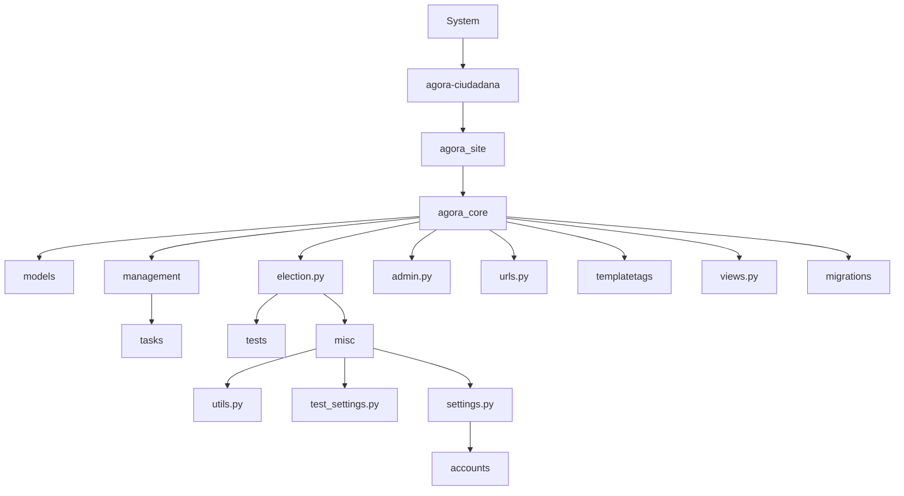
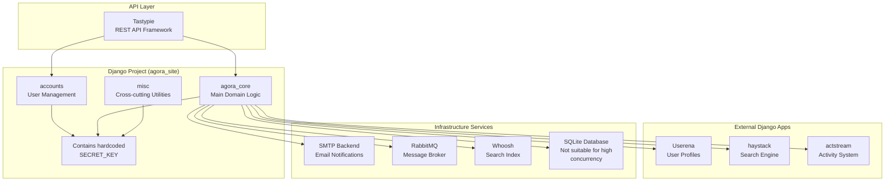

Proyecto de Modernización de Software – Semana 4

Equipo 10

- Julio César Forero Orjuela
- Juan Fernando Copete Mutis
- Jorge Iván Puyo
- Cristhian Camilo Delgado Pazos

# 1. Justificación de la elección de la herramienta de cartografía, puede ser una herramienta de cartografía nueva o de una de las herramientas empleadas en el curso

CodeScene: Esta herramienta proporciona una visualización detallada del estado del repositorio. Permite identificar archivos con alta frecuencia de cambios, analizar la complejidad y salud del código, y detectar áreas críticas que podrían representar deuda técnica. Además, cuenta con un panel interactivo que permite aplicar filtros y visualizar agrupamientos (clustering), facilitando la comprensión de la estructura del sistema y apoyando la toma de decisiones estratégicas para la refactorización.

Claude 4-sonet: Mediante el uso de prompts bien formulados, esta herramienta posibilita un análisis ágil de la arquitectura del sistema, la identificación de deudas técnicas y la sugerencia de módulos candidatos para modernización. La capacidad conversacional del modelo permite integrar conocimientos adquiridos en el curso para enriquecer el análisis, haciendo de esta una herramienta útil para alinear la evaluación técnica con los objetivos académicos y de modernización.

# 2. Listado de preguntas que se desean responder como parte de la comprensión del legado. Mínimo 3 preguntas de la dimensión de arquitectura y 3 de la de mantenibilidad

# Arquitectura:

---


# 1. ¿Cuántas aplicaciones del proyecto existen?

# 2. ¿Qué componente concentra la mayor cantidad de acceso a datos?

# 3. ¿Cuáles son los componentes funcionales del proyecto?

# 4. ¿Cuál es la estrategia de escalabilidad de la aplicación?

# 5. ¿Qué estrategia de caching existe y donde se implementan?

# Mantenibilidad:

# 1. ¿Cuántos modelos de datos existen y cuáles son?

# 2. ¿Qué clase/modelo es referenciado por mayor cantidad de archivos?

# 3. ¿Qué componentes de las vistas de Django tienen más líneas de código y responsabilidades?

# 4. ¿Existe endtrypoints que ya no se utilizan, código zombie?

# 5. ¿Qué dependencias existen entre las Django apps del proyecto?

# 3. Respuestas a las preguntas planteadas:

# Arquitectura

# ¿Cuántas aplicaciones del proyecto existen?

Se evidencias 5 aplicaciones del proyecto:

- Actstream: Seguimiento de actividades
- Userena: sistema de perfiles extendido
- Haystack: Motor de búsqueda
- agota-core: Core del negocio
- accounts: Gestión de cuentas


---


¿Que componente concentra la mayor cantidad de acceso a datos?

Este es el archivo agora_core/views.py, con un tamaño de 1,683 LOC y con un total de 17 operaciones de guardado.

| System                   | agora-ciudadana > agora\_site > agora\_core > views.py |
| ------------------------ | ------------------------------------------------------ |
| Low development activity | Hotspot                                                |


| Code health range | 10.0                               |
| ----------------- | ---------------------------------- |
| Commit threshold  |                                    |
| Combined aspects  | Hotspots \| Code Health \| Defects |
|                   | views.py                           |
|                   | 6.15 Problematic                   |
|                   | Code Health                        |


| Review           | Source Code                 | X-Ray           |
| ---------------- | --------------------------- | --------------- |
| Metrics          | Complexity Trend            | Change Coupling |
| Commits          | 17 commits                  |                 |
| Size             | 1,683 Lines of Code         |                 |
| Main Author      | Eduardo Robles Elvira (98%) |                 |
| Knowledge        | Code in former contributor  |                 |
| Development Cost |                             |                 |
| Modified         | 17 months ago               |                 |


¿Cuales son los componentes funcionales del proyecto?

Gestion de agoras: /agora_core/models/agora.py y agoras /agora_core/resources/agora.py

- Crear y administrar ágoras
- Gestión de membresías

---

# Gestión de administradores

# Sistema de electoral

agora_core/models/election.py, agora_core/resources/election.py

# Creación y configuración de elecciones

Flujo de vida electoral (crear -> aprobar -> congelar -> iniciar -> terminar -> archivar)

Computo de resultados y delegaciones

# Sistema de votación

agora_core/models/castvote.py, agora_core/models/voting_systems/

# Emisión de votos directos

# Sistema de delegación de votos

# Conteo

# Verificación de criptografía

# Gestión de usuarios

accounts/, userena/, agora_core/resources/user.py

# Registro y activación de usuarios

# Perfiles de usuario extendidos

# Gestión y configuración personales

# Sistema de permisos

# Permisos granulares por objeto (Django-guardián)

# Control de acceso basado en roles

# Sistema de actividad social

actstream/

# Stream actividades en tiempo real

# Sistema de seguimiento

# Notificación de acciones

# Sistema de búsqueda

actstream/

# Indexación de ágoras, elecciones y usuarios

---


• Motor de búsqueda full-text
• Filtros y facetas

¿Cuál es la estrategia de escalabilidad de la aplicación?

Actualmente la estrategia de escalabilidad es muy limitada, presentando los
siguientes problemas:

• SQLite: base de datos de archivo único, No escalable
• Sin conexiones concurrentes: bloqueos frecuentes bajo carga
• Sin replicación
• Sin particionamiento: toda la data en un archivo

```
# settings.py - Configuración actual
DATABASES = {
    'default': {
        'ENGINE': 'django.db.backends.sqlite3',
        'NAME': 'data/db.sqlite',
        # SQLite = SINGLE FILE DATABASE ❌
    }
}
```

configuración de la aplicación en Django

¿Qué estrategia de caching existe y donde se implementan?

El sistema tiene una estrategia de caching implementada pero esta desactivada
ya que tiene un cache de 0 segundos.

---


```python
# agora_site/settings.py
# Cache comentado para desarrollo
#CACHES = {
    #'default': {
        #'BACKEND': 'django.core.cache.backends.dummy.DummyCache',
    #}
#}

# Todas las configuraciones de tiempo en CERO
CACHE_MIDDLEWARE_SECONDS = 0  # ❌ Sin cache de middleware
MANY_CACHE_SECONDS = 0        # ❌ Sin cache para datos frecuentes
FEW_CACHE_SECONDS = 0         # ❌ Sin cache para datos críticos
```

Configuración global de chache

```python
# agora_site/agora_core/resources/election.py
@cache_control(s_max_age=settings.MANY_CACHE_SECONDS)  # @ Actualmente = 0
def get_all_votes(self, request, **kwargs):
    """Obtener todos los votos de una elección"""

@cache_control(s_max_age=settings.MANY_CACHE_SECONDS)
def get_cast_votes(self, request, **kwargs):
    """Obtener votos emitidos"""

@cache_control(s_max_age=settings.MANY_CACHE_SECONDS)
def get_delegated_votes(self, request, **kwargs):
    """Obtener votos delegados"""
```

Cache en los endpoints

## Mantenibilidad

¿Cuántos modelos de datos existen, cuales son?

Existen 8 modelos de datos distribuidos de la siguiente manera:

| App         | Modelos   | Archivos   |
| ----------- | --------- | ---------- |
| Agora\_core | 5 modelos | 5 archivos |
| userena     | 2 modelos | 1 archivo  |
| actstream   | 2 modelos | 1 archivo  |
| haystack    | 1 modelo  | 1 archivo  |


---

# ¿Qué clase/modelo es referenciado por mayor cantidad de archivos?

El modelo más referenciado es User con un total de 91 archivos que lo llaman, este modelo es importante para la autenticación, el segundo modelo más llamado es Election este es un modelo de negocio y es llamado en 40 archivos, esto se traduce en una posibilidad de alto acoplamiento y punto único de falla.

---




| Metric | Value |
|--------|-------|
| Code Health | 4.87 Problematic |
| Comments | 0 comments / 1 year |
| Lines of Code | 647 Lines |
| Main Author | Eduardo Robles Elvira (97%) |
| Knowledge | 97% code by former contributors |
| Modified | 17 months ago |

¿Qué componentes de las vistas de Django tienen más líneas de código y responsabilidades?

Esta pregunta se pasó por el modelo claude-4-sonnet y usando la herramienta CodeScene para rectificar, las responsabilidades que tiene la vista son:

- AgoraView - Vista principal de ágora
- AgoraBiographyView - Biografía de ágora
- AgoraElectionsView - Lista de elecciones de ágora
- AgoraMembersView - Gestión de miembros de ágora
- AgoraCommentsView - Comentarios de ágora
- AgoraAdminView - Administración de ágora
- AgoraListView - Lista todas las ágoras
- CreateAgoraView - Crear nueva ágora
- AgoraPostCommentView - Publicar comentarios en ágora

---


# RANKING DE VISTAS POR LÍNEAS DE CÓDIGO

| Posición | Archivo              | LOC   | Clases | Funciones | Promedio LOC   |
| -------- | -------------------- | ----- | ------ | --------- | -------------- |
| 🥇 1°    | agora\_core/views.py | 2,169 | 49     | 2         | 44 LOC/clase   |
| 🥈 2°    | userena/views.py     | 854   | 2      | 10        | 85 LOC/función |
| 🥉 3°    | umessages/views.py   | 272   | \~8    | \~15      | \~18 LOC/comp  |
| 4°       | haystack/views.py    | 234   | 2      | 2         | 58 LOC/comp    |
| 5°       | accounts/views.py    | 115   | 5      | 0         | 23 LOC/clase   |
| 6°       | actstream/views.py   | 109   | \~3    | \~5       | \~14 LOC/comp  |


## 🏆 ANÁLISIS DETALLADO DEL GANADOR: agora_core/views.py

📊 MÉTRICAS CRÍTICAS:

- 2,169 líneas de código (⚠️ CRÍTICO: 4x más grande que el siguiente)
- 49 clases Django (CBV - Class Based Views)
- Solo 2 funciones (FBV - Function Based Views)
- Violación del principio SRP: Una vista = Una responsabilidad

## Respuesta del modelo

[La imagen muestra una visualización de código en CodeScene para el archivo views.py en el sistema agora-ciudadana/agora_site/agora_core. La visualización es un diagrama de burbujas que representa diferentes componentes del código, con círculos de varios tamaños y colores indicando diferentes métricas como complejidad y salud del código.]

## Validación en CodeScene

[La imagen muestra detalles adicionales del análisis de CodeScene para el archivo views.py, incluyendo métricas como actividad de desarrollo, salud del código, y estadísticas de commits.]

---

# 4. Degradación de atributos de calidad.

Durante el proceso de cartografía y análisis del sistema legado se identificaron múltiples atributos de calidad que han sido comprometidos con el paso del tiempo. Estas degradaciones impactan directamente la capacidad del sistema para evolucionar, escalar y mantenerse seguro en entornos actuales.

# Seguridad:

Se encontró la clave secreta SECRET_KEY hardcodeada directamente en el archivo settings.py, una mala práctica crítica que puede comprometer la integridad de sesiones y tokens de autenticación. Además, el uso de un backend SMTP inseguro y la activación del modo DEBUG = True en producción exponen vulnerabilidades OWASP, aumentando el riesgo de ataques.

# Mantenibilidad:

El modelo User es referenciado en al menos 91 archivos, generando un alto nivel de acoplamiento. Este acoplamiento hace difícil modificar o extender la lógica de usuarios sin romper otras partes del sistema, lo cual ralentiza el desarrollo.

# Escalabilidad:

El sistema utiliza SQLite como base de datos principal, lo que limita el acceso concurrente, impide escalar horizontalmente y representa un cuello de botella. Adicionalmente, el sistema tiene desactivado el mecanismo de cacheo (CACHE_MIDDLEWARE_SECONDS = 0), lo que degrada el rendimiento en ambientes de carga media o alta.

# Cumplimiento con los principios Twelve-Factor App:

Se evidencian violaciones directas a factores esenciales:

- III - Config: Uso de valores sensibles embebidos en código.
- IV - Backing Services: SQLite en lugar de un servicio conectable como PostgreSQL.
- XI - Logs: Ausencia de recolección centralizada de logs para monitoreo y depuración.

Estas condiciones justifican la necesidad de una modernización dirigida que priorice la seguridad, el desacoplamiento del módulo de usuarios, y la incorporación de prácticas modernas que aseguren la sostenibilidad técnica del sistema en el mediano plazo.

---


| Atributo          | Evidencia                                            | Severidad  |
| ----------------- | ---------------------------------------------------- | ---------- |
| Seguridad         | SECRET\_KEY hardcodeado, SMTP inseguro, DEBUG = True | Crítica    |
| Mantenibilidad    | Modelo User acoplado a 91 archivos                   | Crítica    |
| Escalabilidad     | SQLite y cache deshabilitado                         | Alta       |
| Cumplimiento 12FA | Violaciones a factors III, IV, XI                    | Media-Alta |


# Estrategia de Modernización y Alcance

## 1. Motivadores de Negocio.

### Mejora de Calidad del Software (Twelve-Factor Compliance)

La aplicación incumple principios fundamentales del modelo Twelve-Factor App,
incluyendo:

- Configuraciones sensibles embebidas en código (SECRET_KEY, SMTP).
- Uso de SQLite en producción.
- Cache deshabilitado.
- Ausencia de logging estructurado.
- Y ausencia de contenedorización, lo cual dificulta la portabilidad, pruebas
consistentes y el despliegue automatizado.
  Adoptar contenedores mediante Docker permitirá cumplir con:
- Factor X (Paridad Dev/Prod): Entornos consistentes.
- Factor V (Build/Release/Run): Separación clara del ciclo de vida de
despliegue.

### Ventaja Competitiva y Nuevas Oportunidades

Al modularizar y dockerizar la gestión de usuarios:

- Se habilitan nuevas integraciones externas, como SSO.
- Se reduce el tiempo de onboarding de nuevos desarrolladores.

---


# 2. Alcance de la Estrategia de modernización.

Se establecen bases para una arquitectura escalable y portable, facilitando pruebas automatizadas y despliegues en múltiples ambientes (on-premise, nube, CI/CD).

# Acciones específicas:

- Refactorización + Wrapping
- Extraer accounts/ y userena/ como módulo desacoplado.
- Exponer API REST con autenticación JWT y base para SSO.
- Externalización de configuración
- Mover SECRET_KEY, claves SMTP y otras variables a entorno.
- Eliminar valores sensibles del código (settings.py).
- Dockerización
- Crear Dockerfile y docker-compose.yml para ambiente local y desarrollo.
- Usar PostgreSQL como base externa conectable (Twelve-Factor IV).
- Establecer procesos reproducibles (Twelve-Factor V y X).
- Análisis estático
- Integrar SonarQube o herramienta equivalente como parte del ciclo de integración continua.
- Automatizar validaciones de calidad y seguridad en cada cambio.

Esta estrategia permite desacoplar, asegurar y contenerizar progresivamente el sistema sin comprometer su funcionalidad actual, sentando las bases para fases posteriores de modernización.


---


# Diagrama de Componentes



El diagrama anterior, generado con Mermaid, permite evidencia de forma gráfica los componentes a trabajar en la modernización.

## Tabla de funcionalidades Priorizadas

---


| ID | Funcionalidad              | Descripción                                     | Criterios de Aceptación                            |
| -- | -------------------------- | ----------------------------------------------- | -------------------------------------------------- |
| F1 | Users API                  | API CRUD de usuarios con JWT                    | Login funcional, documentación, pruebas unitarias  |
| F2 | Externalización config     | Usar variables de entorno para secretos         | No hay secretos en código, validación en CI        |
| F3 | Análisis estático continuo | Integración con SonarQube o Bandit              | Métricas visibles, errores de seguridad reportados |
| F4 | Dockerización              | Crear contenedores para desarrollo y despliegue | Dockerfile y docker-compose.yml funcionales        |


## Uso de Inteligencia Artificial Generativa (IAG)

Se hizo uso de IAG en varias partes del entregable.

Se utilizaron principalmente Claude 4-Sonnet y GitHub Copilot.

Claude fue empleado para estructurar las respuestas de arquitectura y mantenibilidad, validar conceptos del sistema legado, y proponer una estrategia de modernización ajustada al alcance del equipo.

Copilot se utilizó opcionalmente para generar prompts técnicos y diagramas en Mermaid.

Los resultados obtenidos fueron de alta calidad, pero requerían validación manual y ajustes por parte del equipo. Las salidas generadas por la IAG fueron integradas con criterio técnico, evitando errores comunes como alucinaciones o suposiciones incorrectas. En todos los casos, la IAG se usó como complemento para acelerar y enriquecer el análisis técnico, no como reemplazo del criterio del equipo.