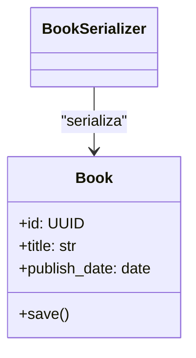

# Prompts aplicados a proyecto en codigo Python con Django, Ajustados para analizar la aplicacion de Agora

Se aplico el modelo Claude-4-sonnet

---

### Prompt 1:

Actúa como un **arquitecto de software experto en Python y Django** realizando un análisis objetivo y detallado de la arquitectura de la aplicación **exclusivamente a partir de su código fuente**.

Tu respuesta debe ser profesional, precisa y estrictamente apegada al código proporcionado, **sin especulaciones ni suposiciones adicionales**. Usa lenguaje técnico claro.

Al finalizar, presenta tus hallazgos en un archivo llamado `` en formato Markdown.

## Preguntas a analizar

1. **Apps de Django y sus responsabilidades**

   * Enumera claramente las aplicaciones Django presentes, indicando explícitamente sus responsabilidades funcionales.
   * Describe sus interrelaciones mediante importaciones, señales y dependencias concretas referidas por nombres de archivos o funciones.

2. **Despliegue en producción**

   * Identifica explícitamente la configuración de despliegue encontrada en código (por ejemplo, WSGI/ASGI con Gunicorn, Daphne, Uvicorn).
   * Confirma si se utilizan contenedores (Docker, Kubernetes).
   * Menciona explícitamente cualquier integración con servicios externos (AWS S3, Redis, Celery workers, etc.) mediante referencias al código fuente.

3. **Interacción con fuentes de datos**

   * Describe detalladamente el uso del ORM (modelos, managers, métodos específicos y consultas complejas).
   * Indica claramente el motor de base de datos utilizado (PostgreSQL, MySQL, SQLite…) a partir de configuraciones específicas (`settings.py`).
   * Confirma si existen caches, colas de mensajes u otros servicios externos, indicando cómo se conectan mediante referencias específicas en código.

4. **Patrones y tácticas de arquitectura**

   * Identifica claramente los patrones arquitectónicos usados (MVC/MVT, CQRS, DDD, Hexagonal, eventos), indicando referencias explícitas en código o estructura.

5. **Tecnologías y frameworks**

   * Enumera todos los frameworks y librerías que componen la solución (Django, Django REST Framework, Celery, Redis, etc.) utilizando como base las dependencias declaradas explícitamente en archivos como `requirements.txt`, `Pipfile` o similares.

6. **Principales capas o módulos**

   * Describe de forma explícita las capas o módulos identificados: Presentación, Dominio, Infraestructura, Integración y Tests, indicando claramente ejemplos concretos desde el código.

7. **Dependencias entre servicios**

   * Indica explícitamente si existen servicios o microservicios independientes comunicándose mediante API interna, gRPC, webhooks, etc., referenciando claramente el código fuente involucrado.

8. **Gestión de seguridad**

   * Identifica explícitamente mecanismos de autenticación/autorización y seguridad encontrados (Django Auth, JWT, OAuth2, middleware CSRF/CORS).
   * Analiza posibles vulnerabilidades relacionadas con la seguridad (según OWASP Top 10 para LLMs), especialmente en términos de **Data Leakage** y **Insecure Plugins**, basado exclusivamente en evidencia del código fuente proporcionado.

9. **Escalabilidad y balanceo de carga**

   * Describe explícitamente los mecanismos identificados para escalabilidad y balanceo de carga (réplicas Gunicorn/ASGI, CDN, caches).

10. **Manejo de errores y resiliencia**

    * Enumera explícitamente estrategias para manejo de errores (middleware, retry, circuit-breaker, logging, Sentry, health checks).

11. **Capas lógicas**

    * Describe explícitamente cómo las capas o módulos se aíslan y orquestan, indicando claramente las referencias al código fuente (paquetes, módulos, apps específicas).

12. **Comunicación con la aplicación**

    * Si expone API REST, extrae explícitamente **todos los endpoints** desde archivos `urls.py` indicando claramente: método HTTP, ruta y función/vista asociada.
    * Si usa otros mecanismos (CLI, GraphQL, WebSockets), descríbelos brevemente con ejemplos claros y específicos extraídos del código.

## Formato de salida requerido:

* Usa encabezados (`##`), listas y bloques de código según convenga.
* Coloca tus respuestas bajo una sección titulada claramente como **“Respuestas”**, inmediatamente después de esta lista de preguntas.
* Mantén un tono estrictamente técnico y profesional.

---


### Prompt 2:

Genera **la estructura completa y precisa de carpetas y archivos** del proyecto backend en Django mediante el análisis objetivo y exhaustivo del repositorio proporcionado.

### Instrucciones específicas:

1. Recorre todo el repositorio y lista estrictamente:

   * Carpetas raíz (ej: `.gitlab-ci`, `docker`, `scripts`, `config`).
   * El directorio del proyecto Django claramente identificado (ej: `myproject/`).
   * Cada **app de Django** junto con sus subcarpetas y archivos clave:

     * `models.py`, `views.py`, `serializers.py`, `urls.py`, `admin.py`, `tests/`, `migrations/`.
     * Incluye explícitamente cualquier directorio adicional como `services/`, `repositories/`, o cualquier otro patrón que refleje la arquitectura en capas (Presentación, Dominio, Infraestructura, Integración).
   * Archivos esenciales de configuración claramente identificados y comentados:

     * `settings.py`, `asgi.py`, `wsgi.py`, `manage.py`, `requirements.txt`, `Dockerfile`, `pyproject.toml`.
   * Archivos ocultos o sensibles (ej. `.env`, `.gitignore`, certificados) deben listarse explícitamente solo si están presentes, acompañados de un breve comentario sobre su uso y seguridad.

2. Usa estrictamente un formato visual claro y estilo «árbol» con indentación consistente por nivel.

3. **Al lado de cada archivo**, incluye breves comentarios técnicos que expliquen claramente su propósito funcional.

4. Refleja claramente la **arquitectura en capas** cuando aplique:

   * Ejemplos claros de mapeo entre capas como `controllers (views.py) → services → repositories → domain models`.

5. Considera explícitamente las siguientes vulnerabilidades según el OWASP Top 10 para LLMs en el análisis:

   * Data Leakage: resalta posibles archivos sensibles o expuestos (ej.: secretos en código).
   * Insecure Plugins: identifica explícitamente cualquier configuración insegura o plugin externo vulnerable (si existen).

6. No debes generar inferencias creativas ni incluir elementos que no existan realmente en el código fuente proporcionado.

### Formato final requerido:

Presenta el resultado final en un archivo llamado `diagrams.md` claramente bajo la sección **“Estructura de carpetas”**.

### Ejemplo de formato requerido:

```text
myproject/
 ├── manage.py                    # script para gestionar comandos Django
 ├── myproject/                   # paquete raíz del proyecto
 │   ├── settings.py              # configuraciones globales (seguridad, middleware, DB)
 │   ├── urls.py                  # rutas principales del proyecto
 │   ├── wsgi.py                  # entrada WSGI para despliegue (Gunicorn)
 │   └── asgi.py                  # entrada ASGI para despliegue (Uvicorn/Daphne)
 ├── books/                       # aplicación Django “books”
 │   ├── models.py                # modelos del dominio: Book, Author
 │   ├── views.py                 # controladores (vistas) HTTP (function/class-based)
 │   ├── serializers.py           # serializadores DRF para validación/conversión JSON
 │   ├── urls.py                  # endpoints específicos de la aplicación
 │   ├── admin.py                 # configuración del admin de Django
 │   ├── services/                # lógica de negocio reutilizable y centralizada
 │   │   └── book_service.py      # operaciones de negocio específicas para libros
 │   └── tests/
 │       └── test_views.py        # pruebas unitarias específicas para las vistas
 ...
```

---


## Prompt 3 Creación del archivo `DiagramsMermaid.md`

Usando **exclusivamente** la información documentada previamente en los archivos `architecture.md`, `diagrams.md`, y tomando en cuenta las recomendaciones del documento OWASP Top 10 para LLMs, actúa como un **arquitecto de software experto** especializado en Django y seguridad, y genera un archivo denominado `DiagramsMermaid.md` que contenga detalladamente los siguientes diagramas utilizando la sintaxis Mermaid.js.

### Contenido del archivo `DiagramsMermaid.md`:


# Diagramas Arquitectónicos en Mermaid.js - Proyecto Django (Agora Ciudadana)

## 1. Diagrama de Componentes

Incluye aplicaciones principales y externas, servicios de infraestructura (RabbitMQ, SMTP, Whoosh), indicando claramente interacciones según análisis previo.

## 2. Diagrama de Despliegue

Componentes reales identificados (WSGI, Celery, SQLite, Whoosh, RabbitMQ), incluyendo vulnerabilidades y puntos críticos según OWASP.

## 3. Diagrama de Flujo de Datos

Flujo explícito: Request HTTP → View → Serializer (Tastypie) → Modelo → DB SQLite, con comentarios específicos sobre validaciones y manejo seguro de datos sensibles según OWASP.

## 4. Diagramas de Clases (por app)

### Agora Core

Clases exactas y relaciones identificadas para Agora (Agora, Election, CastVote, Profile, etc.), atributos y métodos según documentación previa.

### Accounts

Clases exactas relacionadas con autenticación, perfiles, y formularios personalizados según documentación previa.

## 5. Diagrama de Paquetes

Estructura explícita de apps y paquetes (agora_core, accounts, misc), mostrando dependencias reales entre ellos según estructura documentada.


### Restricciones Críticas:

- **No inferencias creativas**: Todos los elementos deben reflejar estrictamente la información real documentada.
- Incluir explícitamente comentarios Mermaid (`%%`) indicando claramente puntos críticos de seguridad destacados según OWASP Top 10 LLMs:
  - Versión obsoleta de Django (1.5.5).
  - Clave secreta hardcodeada y modo DEBUG activado.
  - SQLite como riesgo de escalabilidad y concurrencia.


### Convenciones técnicas:

* Usa adecuadamente los tipos de diagramas Mermaid:

  * Componentes: `graph TD`.
  * Despliegue: `graph TD`.
  * Flujo de Datos: `flowchart TD`.
  * Clases: `classDiagram`.
  * Paquetes: `graph TD`.

* **Nombres de clases, métodos, atributos y archivos deben coincidir exactamente** con la información generada previamente.

* Etiqueta claramente los elementos críticos desde una perspectiva de seguridad, especialmente en flujos sensibles según OWASP (p.ej., "manejo datos sensibles").

### Ejemplo mínimo de sintaxis Mermaid requerida:



---

