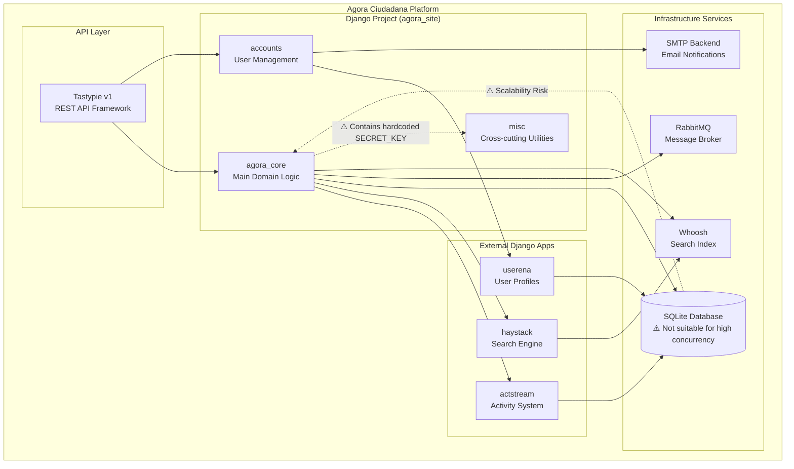
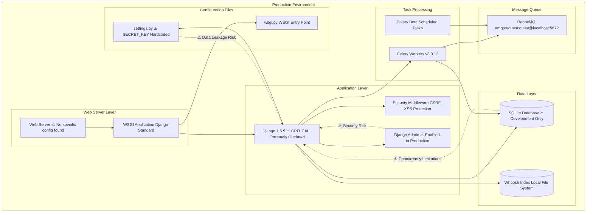
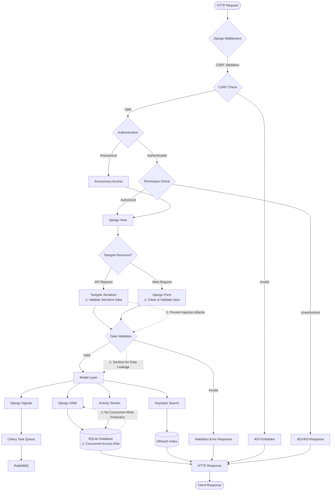
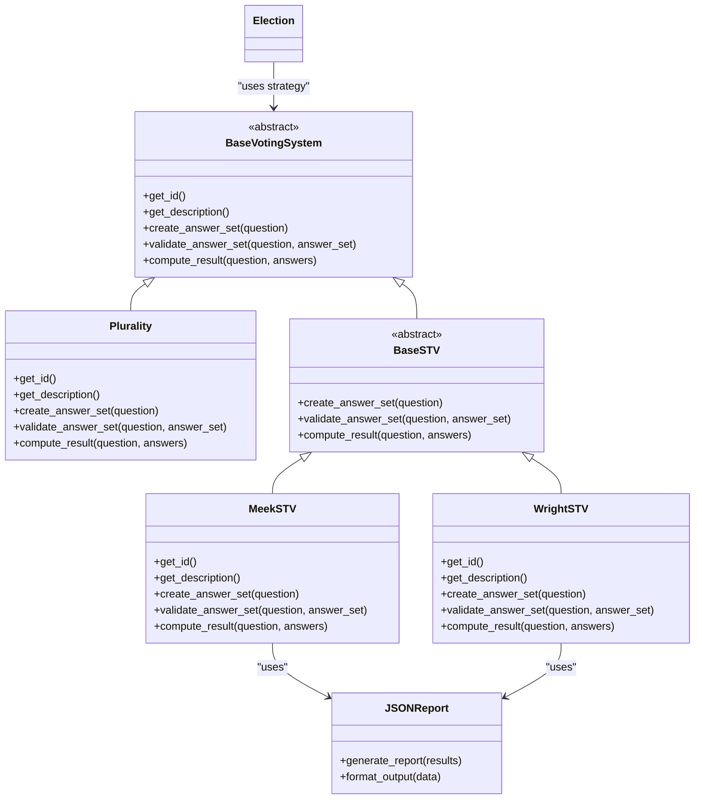
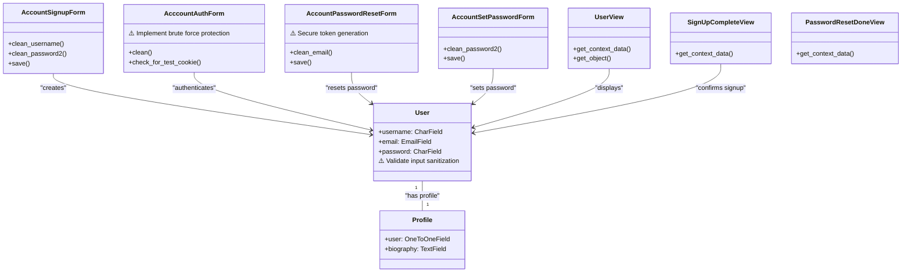
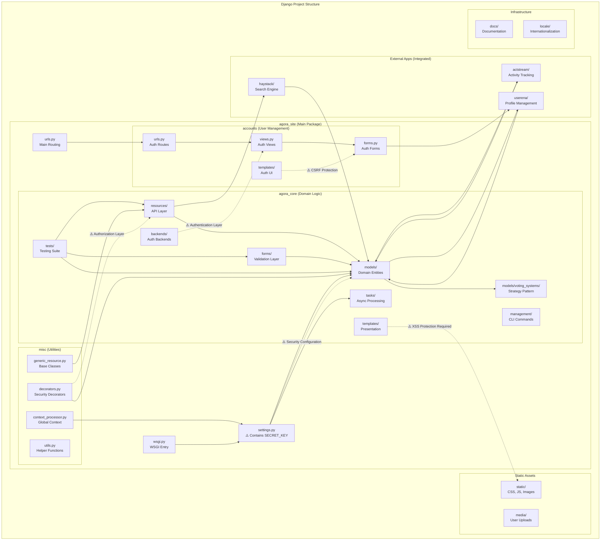

# Diagramas Arquitectónicos en Mermaid.js - Proyecto Django (Agora Ciudadana)

## 1. Diagrama de Componentes

## 2. Diagrama de Despliegue

## 3. Diagrama de Flujo de Datos

## 4. Diagramas de Clases (por app)

### Agora Core

```mermaid
classDiagram
    %% OWASP: Domain models with security considerations

    class User {
        +username: CharField
        +email: EmailField
        +password: CharField
    }

    class Profile {
        +user: OneToOneField
        +short_description: CharField
        +biography: TextField
        +last_activity_read_date: DateTimeField
        +lang_code: CharField
        +email_updates: BooleanField
        +extra: JSONField
        +get_fullname()
        +get_initials()
        +add_to_agora(request, agora_name, agora_id)
        +has_perms(permission_name, user)
        +get_perms(user)
        +count_direct_votes()
    }
    
    class Agora {
        +creator: ForeignKey
        +delegation_election: ForeignKey
        +created_at_date: DateTimeField
        +archived_at_date: DateTimeField
        +name: CharField
        +pretty_name: CharField
        +url: URLField
        +short_description: CharField
        +biography: TextField
        +image_url: URLField
        +is_vote_secret: BooleanField
        +election_type: CharField
        +eligibility: JSONField
        +membership_policy: CharField
        +comments_policy: CharField
        +delegation_policy: CharField
        +members: ManyToManyField
        +admins: ManyToManyField
        +extra_data: JSONField
        +create_name(creator)
        +get_open_elections()
        +has_perms(permission_name, user)
        +get_delegated_vote_for_user(user)
    }
    
    class Election {
        +hash: CharField
        +tiny_hash: CharField
        +uuid: CharField
        +url: CharField
        +agora: ForeignKey
        +creator: ForeignKey
        +electorate: ManyToManyField
        +parent_election: ForeignKey
        +created_at_date: DateTimeField
        +is_vote_secret: BooleanField
        +is_approved: BooleanField
        +comments_policy: CharField
        +voting_starts_at_date: DateTimeField
        +voting_ends_at_date: DateTimeField
        +voting_extended_until_date: DateTimeField
        +result: TextField
        +pretty_name: CharField
        +name: CharField
        +short_description: CharField
        +description: TextField
        +questions: JSONField
        +delegated_votes: ManyToManyField
        +election_type: CharField
        +eligibility: JSONField
        +extra_data: JSONField
        +get_serializable_data()
        +create_hash()
        +has_started()
        +has_ended()
        +is_archived()
        +is_frozen()
        +is_tallied()
        +has_perms(permission_name, user)
        +compute_result()
    }
    
    class CastVote {
        +voter: ForeignKey
        +election: ForeignKey
        +created_at_date: DateTimeField
        +is_direct: BooleanField
        +is_counted: BooleanField
        +invalidated_at_date: DateTimeField
        +data: TextField
        +casted_at_date: DateTimeField
        +hash: CharField
        +tiny_hash: CharField
        +voter_secret: CharField
        +get_serializable_data()
        +create_hash()
        +has_perms(permission_name, user)
    }
    
    class DelegateElectionCount {
        +election: ForeignKey
        +delegate: ForeignKey
        +count: IntegerField
        +count_percentage: FloatField
        +created_at_date: DateTimeField
    }
    
    %% Relationships
    Profile --|> User : "extends"
    Agora "1" o-- "*" Election : "contains"
    Election "1" o-- "*" CastVote : "receives"
    Election "1" o-- "*" DelegateElectionCount : "tracks"
    Profile "*" -- "*" Agora : "member of"
    Profile "*" -- "*" Agora : "admin of"
    CastVote "*" --> "1" Profile : "cast by"
```

### Voting Systems (Strategy Pattern)

### Accounts

## 5. Diagrama de Paquetes

## Notas de Seguridad OWASP Top 10

### Vulnerabilidades Críticas Identificadas:

1. **Data Leakage (Clasificación Alta)**
   - SECRET_KEY hardcodeada en `settings.py`
   - DEBUG=True habilitado por defecto
   - Configuración de admin habilitada para producción

2. **Insecure Plugins (Clasificación Alta)**
   - Django 1.5.5: Versión extremadamente obsoleta con CVEs conocidos
   - Dependencias sin versionado específico en `requirements.txt`
   - Backend FNMT personalizado con configuración no validada

3. **Riesgos de Escalabilidad y Concurrencia**
   - SQLite inadecuada para entornos de alta concurrencia
   - Sin configuración de cache habilitada
   - Sin balanceadores de carga configurados

### Recomendaciones de Mitigación:

- Actualizar Django a versión LTS soportada
- Externalizar SECRET_KEY a variables de entorno
- Migrar de SQLite a PostgreSQL para producción
- Implementar configuración adecuada de cache
- Revisar y actualizar todas las dependencias
- Deshabilitar admin interface en producción
- Configurar logging y monitoreo de seguridad 