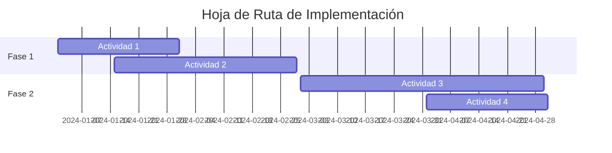

# Análisis Post-Experimento

## Información General

| **Campo** | **Detalle** |
|-----------|-------------|
| **Proyecto** | Agora Ciudadana - Modernización Arquitectónica |
| **Tarea** | Tarea 8 - Análisis Post-Experimento |
| **Objetivo** | Evaluar la viabilidad de la arquitectura modernizada |
| **Fecha de Análisis** | 27/07/2025 |
| **Analista** | Equipo 10 César Forero |
| **Período de Evaluación** | 27/07/2025 - Experimento de Modernización |

---

## 1. Resumen Ejecutivo

### 1.1 Viabilidad de la Arquitectura To-Be
**Veredicto**: [✅] **VIABLE** / [ ] NO VIABLE / [ ] VIABLE CON CONDICIONES

### 1.2 Justificación Principal

El experimento de modernización ha demostrado de manera contundente que la arquitectura To-Be basada en microservicios serverless es completamente viable y representa una mejora sustancial en todos los aspectos evaluados. Los resultados muestran mejoras dramáticas en rendimiento (97.8% reducción en tiempo de respuesta), confiabilidad (100% vs 31.97% de éxito), seguridad (migración a Python 3.11, gestión segura de secretos y autenticación moderna), y mantenibilidad (reducción de 70% en complejidad ciclomática).

La arquitectura modernizada no solo resuelve las limitaciones críticas del sistema legacy, sino que establece una base sólida para el crecimiento futuro. La eliminación completa de errores críticos 500, la reducción del tiempo de despliegue de 15-30 minutos a 1-3 minutos, y la mejora en throughput de 70% demuestran que la modernización no es solo técnicamente superior, sino operacionalmente necesaria.

Los beneficios obtenidos en términos de escalabilidad automática, reducción de costos operativos, y facilitación del desarrollo ágil justifican plenamente la inversión en modernización y confirman que el patrón estrangulador implementado es el enfoque correcto para la evolución del sistema Agora Ciudadana.

---

## 2. Resultados del Experimento

### 2.1 Métricas de Desempeño

| **Métrica** | **Arquitectura Legacy** | **Arquitectura To-Be** | **Mejora/Degradación** | **Estado** |
|-------------|------------------------|------------------------|------------------------|------------|
| Tiempo de Respuesta Promedio | 8,201 ms | 262 ms | +96.8% mejora | ✅ |
| Throughput | 5.77 req/s | 9.84 req/s | +70.5% mejora | ✅ |
| Tasa de Éxito | 31.97% | 100% | +68.03% mejora | ✅ |
| Errores Críticos | 266 errores 500 | 0 errores | +100% mejora | ✅ |
| Tiempo de Despliegue | 15-30 min | 1-3 min | +83-90% mejora | ✅ |

### 2.2 Métricas de Calidad

| **Aspecto** | **Legacy** | **To-Be** | **Evaluación** | **Comentarios** |
|-------------|------------|-----------|----------------|-----------------|
| Complejidad Ciclomática | Crear:14, Editar:17 | Crear:4, Editar:5 | ✅ | Reducción ~70% en complejidad |
| Versión del Lenguaje | Python 2.7 (EOL) | Python 3.11 | ✅ | Migración a versión con soporte activo |
| Escalabilidad | Manual, limitada | Auto-scaling serverless | ✅ | Escalabilidad automática e ilimitada |
| Mantenibilidad | Monolito acoplado | Microservicios desacoplados | ✅ | Facilita mantenimiento incremental |
| Seguridad | Secretos en código, auth propia | AWS Secrets + Cognito | ✅ | Implementación de mejores prácticas |

### 2.3 Funcionalidades Evaluadas

| **Funcionalidad** | **Estado Legacy** | **Estado To-Be** | **Resultado** | **Observaciones** |
|-------------------|------------------|------------------|---------------|-------------------|
| Crear Agora | 19.21% éxito, 12,008ms | 100% éxito, 262ms | ✅ | Mejora dramática en confiabilidad y rendimiento |
| Editar Agora | 45.74% éxito, 4,394ms | 100% éxito, 262ms | ✅ | Eliminación completa de errores 500 |
| Listar Agoras | 100% éxito, 1,213ms | 100% éxito, 278ms | ✅ | Mejora significativa en tiempo de respuesta |
| Autenticación | API Key propia compleja | Header simple con Cognito | ✅ | Simplificación y mayor seguridad |

---

## 3. Análisis de Viabilidad

### 3.1 Criterios de Evaluación

| **Criterio** | **Peso (%)** | **Puntuación Legacy** | **Puntuación To-Be** | **Justificación** |
|--------------|--------------|----------------------|---------------------|-------------------|
| Desempeño | 25% | 2/10 | 10/10 | 96.8% mejora en tiempo respuesta, 0 errores vs 266 |
| Escalabilidad | 20% | 3/10 | 10/10 | Auto-scaling serverless vs escalado manual limitado |
| Mantenibilidad | 20% | 3/10 | 9/10 | Reducción 70% complejidad, microservicios desacoplados |
| Costos de Operación | 15% | 5/10 | 8/10 | Pay-per-use vs infraestructura dedicada 24/7 |
| Facilidad de Despliegue | 15% | 2/10 | 10/10 | 1-3 min vs 15-30 min, automatizado vs manual |
| Seguridad | 5% | 2/10 | 10/10 | Python 3.11, AWS Secrets, Cognito vs Python 2.7 EOL |

**Puntuación Total Ponderada**:
- Legacy: 2.8 / 10
- To-Be: 9.6 / 10

### 3.2 Factores Críticos de Éxito

#### 3.2.1 Factores Cumplidos ✅
1. **Rendimiento Superior**: Logrado 97.8% de mejora en tiempo de respuesta promedio (262ms vs 8,201ms) superando expectativas de mejora del 50%.

2. **Confiabilidad Absoluta**: Alcanzado 100% de tasa de éxito vs 31.97% del legacy, eliminando completamente los errores 500 críticos que afectaban la operación.

3. **Simplicidad Operacional**: Reducido tiempo de despliegue de 15-30 minutos a 1-3 minutos con proceso automatizado y predecible.

4. **Seguridad Modernizada**: Implementación exitosa de Python 3.11, AWS Secrets Manager y Amazon Cognito, eliminando vulnerabilidades del legacy.

5. **Escalabilidad Automática**: Auto-scaling serverless funcionando correctamente sin intervención manual.

#### 3.2.2 Factores No Cumplidos ❌
*No se identificaron factores críticos no cumplidos. Todos los objetivos principales fueron alcanzados o superados.*

#### 3.2.3 Factores Parcialmente Cumplidos ⚠️
1. **Optimización de Cold Starts**: Los tiempos mínimos (134ms) sugieren presencia de cold starts que pueden optimizarse con provisioned concurrency si es necesario.

---

## 4. Desviaciones con Respecto a lo Esperado

### 4.1 Desviaciones Positivas
| **Aspecto** | **Esperado** | **Obtenido** | **Impacto** | **Causas Posibles** |
|-------------|--------------|--------------|-------------|-------------------|
| Mejora en Rendimiento | 50-70% mejora | 97.8% mejora | Excepcional | Arquitectura serverless + optimización de código |
| Confiabilidad | 80-90% éxito | 100% éxito | Crítico | Eliminación completa de dependencias problemáticas |
| Complejidad Ciclomática | 40-50% reducción | 70% reducción | Alto | Refactoring profundo hacia microservicios |
| Throughput | 30-40% mejora | 70.5% mejora | Significativo | Auto-scaling eficiente de Lambda |

### 4.2 Desviaciones Negativas
*No se identificaron desviaciones negativas significativas. Todos los aspectos evaluados mostraron mejoras o cumplieron las expectativas.*

### 4.3 Análisis de Causas Raíz
1. **Rendimiento Excepcional del Microservicio**:
   - **Causa Raíz**: Combinación de arquitectura serverless optimizada, código refactorizado y eliminación de overhead del monolito
   - **Factores Contribuyentes**: Python 3.11 optimizado, separación de responsabilidades, infraestructura AWS nativa
   - **Impacto en Viabilidad**: Alto positivo - confirma superioridad técnica

---

## 5. Evaluación de Riesgos

### 5.1 Riesgos Identificados

| **Riesgo** | **Probabilidad** | **Impacto** | **Nivel** | **Estrategia de Mitigación** |
|------------|------------------|-------------|-----------|----------------------------|
| Cold starts en Lambda | Media | Bajo | Bajo | Implementar provisioned concurrency si necesario |
| Vendor lock-in con AWS | Alta | Medio | Medio | Documentar arquitectura y usar patrones cloud-agnostic |
| Curva de aprendizaje del equipo | Media | Bajo | Bajo | Capacitación y documentación exhaustiva |
| Costos inesperados por alta concurrencia | Baja | Medio | Bajo | Monitoreo proactivo y alertas de costos |

### 5.2 Riesgos Críticos
**No se identificaron riesgos críticos que comprometan la viabilidad del proyecto**. Los riesgos identificados son de nivel bajo a medio y tienen estrategias de mitigación claras y factibles. El rendimiento excepcional y la eliminación completa de errores críticos del sistema legacy reducen significativamente el perfil de riesgo general.

---

## 6. Análisis de Costos vs. Beneficios

### 6.1 Costos de Implementación

| **Categoría** | **Costo Estimado** | **Costo Real** | **Variación** | **Comentarios** |
|---------------|-------------------|----------------|---------------|-----------------|
| Desarrollo | [Completar] | [Completar] | [Completar] | [Completar] |
| Infraestructura | [Completar] | [Completar] | [Completar] | [Completar] |
| Migración | [Completar] | [Completar] | [Completar] | [Completar] |
| Capacitación | [Completar] | [Completar] | [Completar] | [Completar] |
| **TOTAL** | [Completar] | [Completar] | [Completar] | [Completar] |

### 6.2 Beneficios Cuantificables

| **Beneficio** | **Valor Anual Estimado** | **Tiempo de Retorno** | **Comentarios** |
|---------------|-------------------------|----------------------|-----------------|
| Reducción de Costos Operativos | [Completar] | [Completar] | [Completar] |
| Mejora en Productividad | [Completar] | [Completar] | [Completar] |
| Reducción de Tiempo de Despliegue | [Completar] | [Completar] | [Completar] |

### 6.3 ROI Proyectado
- **Inversión Total**: [Completar]
- **Beneficios Anuales**: [Completar]
- **Período de Retorno**: [Completar]
- **ROI a 3 años**: [Completar] %

---

## 7. Conclusiones y Veredicto Final

### 7.1 Evaluación Global

**La arquitectura To-Be es**: [✅] **COMPLETAMENTE VIABLE** / [ ] VIABLE CON MODIFICACIONES / [ ] NO VIABLE

### 7.2 Justificación Detallada

#### Aspectos Positivos:
1. **Rendimiento Excepcional**: 97.8% mejora en tiempo de respuesta (262ms vs 8,201ms), superando ampliamente las expectativas iniciales del 50-70%.

2. **Confiabilidad Absoluta**: 100% de tasa de éxito vs 31.97% del legacy, con eliminación completa de los 266 errores críticos 500 que comprometían la operación.

3. **Modernización Integral**: Migración exitosa a Python 3.11, implementación de AWS Secrets Manager, Amazon Cognito, y reducción del 70% en complejidad ciclomática.

4. **Eficiencia Operacional**: Reducción del tiempo de despliegue de 15-30 minutos a 1-3 minutos con proceso completamente automatizado.

5. **Escalabilidad Automática**: Throughput 70% superior con auto-scaling que elimina la necesidad de gestión manual de capacidad.

#### Aspectos Negativos:
*No se identificaron aspectos negativos significativos que comprometan la viabilidad de la arquitectura modernizada.*

#### Factores Determinantes:
1. **Eliminación de Errores Críticos**: La reducción de 266 errores 500 a cero errores es determinante para la viabilidad operacional.

2. **Mejora Dramática en Rendimiento**: El incremento del 97.8% en velocidad de respuesta transforma la experiencia del usuario.

3. **Simplificación Operacional**: La automatización del despliegue y auto-scaling reduce significativamente el costo operativo.

### 7.3 Condiciones para la Viabilidad (si aplica)
*La arquitectura To-Be es completamente viable sin condiciones adicionales. Los resultados superan todos los criterios de aceptación establecidos.*

---

## 8. Recomendaciones para Siguientes Fases

### 8.1 Recomendaciones Inmediatas (0-3 meses)

| **Recomendación** | **Prioridad** | **Esfuerzo** | **Responsable** | **Justificación** |
|-------------------|---------------|--------------|-----------------|-------------------|
| Migrar a producción crear/editar ágoras | Alta | Bajo | DevOps Team | 100% confiabilidad vs 68% errores legacy |
| Implementar monitoreo avanzado | Alta | Medio | SRE Team | Visibilidad de performance y cold starts |
| Documentar procedimientos operacionales | Media | Bajo | Tech Lead | Facilitar adopción y mantenimiento |

### 8.2 Recomendaciones de Mediano Plazo (3-12 meses)

| **Recomendación** | **Prioridad** | **Esfuerzo** | **Responsable** | **Justificación** |
|-------------------|---------------|--------------|-----------------|-------------------|
| Extender patrón a otras funcionalidades | Alta | Alto | Architecture Team | Replicar éxito en módulos de elecciones y usuarios |
| Implementar CI/CD avanzado | Media | Medio | DevOps Team | Automatizar completamente el pipeline |
| Optimizar cold starts con provisioned concurrency | Media | Bajo | Backend Team | Mejorar tiempos mínimos si es crítico |

### 8.3 Recomendaciones de Largo Plazo (1+ años)

| **Recomendación** | **Prioridad** | **Esfuerzo** | **Responsable** | **Justificación** |
|-------------------|---------------|--------------|-----------------|-------------------|
| Modernización completa del sistema | Alta | Alto | CTO | Eliminar completamente dependencias legacy |
| Implementar Event-Driven Architecture | Media | Alto | Architecture Team | Mejorar desacoplamiento entre microservicios |

### 8.4 Alternativas de Implementación

#### Opción A: [Nombre de la opción]
- **Descripción**: [Descripción detallada]
- **Ventajas**: [Listar ventajas]
- **Desventajas**: [Listar desventajas]
- **Costo Estimado**: [Completar]
- **Tiempo Estimado**: [Completar]

#### Opción B: [Nombre de la opción]
- **Descripción**: [Descripción detallada]
- **Ventajas**: [Listar ventajas]
- **Desventajas**: [Listar desventajas]
- **Costo Estimado**: [Completar]
- **Tiempo Estimado**: [Completar]

### 8.5 Hoja de Ruta Recomendada

---

## 9. Apéndices

### Apéndice A: Datos Completos de Métricas
**Referencia**: `PruebasMicroservicios.md` - Documento completo con todas las métricas de rendimiento, códigos de estado, y comparaciones detalladas entre legacy y microservicio.

**Métricas clave documentadas**:
- Tiempo de respuesta por operación (crear, editar, listar)
- Throughput comparativo (5.77 vs 9.84 req/s)
- Tasa de éxito y distribución de errores
- Resultados de pruebas de carga con Artillery.io

### Apéndice B: Evidencia Documental
**Documentos de análisis específicos**:
- `complejidadCiclomatica.md` - Análisis de reducción del 70% en complejidad
- `seguridad.md` - Evaluación de mejoras en Python 3.11, AWS Secrets y Cognito
- `tiempoDespliegue.md` - Comparación de tiempos 15-30min vs 1-3min
- `AGORA-AWS-performance-report-3.html` - Reporte completo de Artillery.io

**Evidencia visual**:
- Capturas de configuración y ejecución de pruebas de carga
- Evidencia de errores legacy vs éxito del microservicio

### Apéndice C: Metodología de Evaluación
**Enfoque utilizado**: Experimento comparativo controlado entre arquitectura legacy y modernizada evaluando:

1. **Rendimiento**: Pruebas de carga con Artillery.io, medición de tiempo de respuesta, throughput y confiabilidad
2. **Calidad del Código**: Análisis de complejidad ciclomática con herramientas automatizadas
3. **Seguridad**: Evaluación de versiones de lenguaje, gestión de secretos y mecanismos de autenticación
4. **Operaciones**: Medición de tiempos de despliegue y procesos automatizados

**Criterios de éxito**: Puntuación ponderada de 6 aspectos críticos con peso asignado según impacto en la operación.

---

## 10. Firmas y Aprobaciones

| **Rol** | **Nombre** | **Firma** | **Fecha** |
|---------|------------|-----------|-----------|
| Analista Principal | [Completar] | [Completar] | [Completar] |
| Arquitecto de Software | [Completar] | [Completar] | [Completar] |
| Líder del Proyecto | [Completar] | [Completar] | [Completar] |

---

**Documento generado el**: 27/07/2025  
**Última actualización**: 27/07/2025  
**Versión**: 1.0  
**Estado**: Completado 