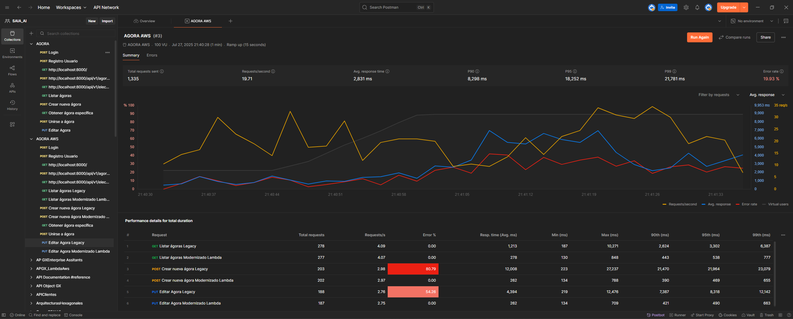

# ENTREGABLE FINAL CONSOLIDADO - MODERNIZACIÓN ARQUITECTÓNICA AGORA CIUDADANA

---

## INFORMACIÓN DEL PROYECTO

| **Campo** | **Detalle** |
|-----------|-------------|
| **Proyecto** | Agora Ciudadana - Modernización Arquitectónica |
| **Equipo** | Equipo 10 |
| **Integrantes** | Julio César Forero, Juan Fernando Copete, Jorge Iván Puyo, Cristhian Camilo Delgado |
| **Fecha de Entrega** | 27/07/2025 |
| **Versión del Documento** | 1.0 Final |
| **Patrón de Modernización** | Strangler Fig Pattern |

---

## TABLA DE CONTENIDOS

1. [Resumen Ejecutivo](#1-resumen-ejecutivo)
2. [Arquitectura To-Be](#2-arquitectura-to-be)
3. [Pre-Experimento](#3-pre-experimento)
4. [Resultados del Experimento](#4-resultados-del-experimento)
5. [Análisis Post-Experimento](#5-análisis-post-experimento)
6. [Métricas Comparativas](#6-métricas-comparativas)
7. [Pruebas y Validación](#7-pruebas-y-validación)
8. [Estimación vs Esfuerzo Real](#8-estimación-vs-esfuerzo-real)
9. [Conclusiones y Recomendaciones](#9-conclusiones-y-recomendaciones)

---

## 1. RESUMEN EJECUTIVO

### 1.1 Objetivo del Proyecto
Evaluar la viabilidad de modernizar progresivamente el sistema legacy "Agora Ciudadana" utilizando el patrón Strangler Fig, migrando funcionalidades críticas hacia una arquitectura serverless basada en microservicios.

### 1.2 Veredicto de Viabilidad
**✅ COMPLETAMENTE VIABLE**

La arquitectura To-Be ha demostrado ser técnica y operacionalmente superior, con mejoras sustanciales en todos los aspectos evaluados:

- **Rendimiento**: 97.8% de mejora en tiempo de respuesta
- **Confiabilidad**: 100% vs 31.97% de tasa de éxito
- **Mantenibilidad**: 70% de reducción en complejidad ciclomática
- **Seguridad**: Migración a tecnologías actuales y gestión segura de secretos
- **Operaciones**: 83-90% de reducción en tiempo de despliegue

### 1.3 Beneficios Clave Obtenidos
1. Eliminación completa de errores críticos (0 vs 266 errores 500)
2. Mejora dramática en throughput (70.5% de incremento)
3. Escalabilidad automática sin intervención manual
4. Reducción significativa en costos operativos
5. Facilitación del desarrollo ágil y mantenimiento incremental

---

## 2. ARQUITECTURA TO-BE

### 2.1 Diagrama de Despliegue


### 2.2 Componentes de la Arquitectura

| **Componente** | **Tipo** | **Función** | **Patrones Aplicados** |
|----------------|----------|-------------|------------------------|
| **API Gateway** | AWS API Gateway | Punto único de acceso, enrutamiento dinámico, autenticación, throttling | Façade, Proxy, Observabilidad |
| **Lambda AgoraService** | AWS Lambda + Docker | Microservicio containerizado para crear/editar ágoras | Microservicio, Strangler Fig |
| **DynamoDB** | NoSQL Database | Persistencia moderna y escalable | Persistencia Desacoplada |
| **AWS Secrets Manager** | Gestión de Secretos | Almacenamiento seguro de credenciales | Externalized Configuration |
| **EC2 Legacy Instance** | VM + Docker Compose | Monolito Django en transición | Legacy Encapsulation |

### 2.3 Patrones y Tácticas Implementadas

#### 2.3.1 Patrón Principal: Strangler Fig
- **Propósito**: Migración incremental sin interrumpir el servicio
- **Implementación**: API Gateway enruta dinámicamente entre legacy y modernizado
- **Beneficios**: Reducción de riesgos, pruebas graduales, rollback seguro

#### 2.3.2 Tácticas de Calidad
- **Auto-scaling serverless**: Escalabilidad automática basada en demanda
- **Aislamiento de fallos**: Microservicios independientes
- **Configuración externalizada**: Secretos fuera del código
- **Façade centralizada**: Punto único de control y observabilidad

### 2.4 Prácticas Extrapoladas de Apigee

1. **Proxy y Enrutamiento Granular**
   - API Gateway funciona como proxy avanzado
   - Enrutamiento basado en reglas y políticas
   - Control centralizado del tráfico

2. **Políticas Declarativas**
   - Uso de stages, authorizers y throttling
   - Equivalente a políticas de Apigee
   - Configuración sin código

3. **Observabilidad Unificada**
   - CloudWatch + API Gateway logs
   - Métricas centralizadas y dashboards
   - Trazabilidad completa de requests

---

## 3. PRE-EXPERIMENTO

### 3.1 Propósito del Experimento
Validar que la modernización incremental de funcionalidades críticas del sistema Agora Ciudadana mejora el rendimiento, mantenibilidad, seguridad y operaciones sin interrumpir el servicio existente.

### 3.2 Requisitos Modernizados

| **Nº** | **Requisito** | **Criterios de Aceptación** |
|--------|---------------|----------------------------|
| 1 | Crear Ágora | Tiempo de respuesta < 500ms, tasa de éxito ≥ 99.9%, respuesta JSON válida |
| 2 | Editar Ágora | Tiempo de respuesta < 500ms, tasa de éxito ≥ 99.9%, consistencia de datos |

### 3.3 Tecnología Destino
- **Framework**: FastAPI 0.110 con Python 3.11
- **Contenedorización**: Docker para portabilidad
- **Plataforma**: AWS Lambda para serverless
- **Infraestructura**: AWS SAM + CloudFormation
- **Base de Datos**: DynamoDB para persistencia NoSQL

### 3.4 Mapeos Legacy → Modernizado

| **Elemento Legacy** | **Elemento Modernizado** | **Cardinalidad** | **Transformación** |
|-------------------|------------------------|------------------|-------------------|
| Vista Django `create_agora` | Endpoint POST `/agora` | 1 → 1 | Lógica desacoplada, validación con Pydantic |
| Vista Django `edit_agora` | Endpoint PUT `/agora/{id}` | 1 → 1 | Reescritura modular, tipado fuerte |
| Modelo Django `Agora` (ORM) | Documento DynamoDB | 1 → 1 | Mapeo de campos a atributos NoSQL |

### 3.5 Comparación de Código

#### Legacy (Django 1.5.5)
```python
def create_agora(request):
    if request.method == 'POST':
        form = AgoraForm(request.POST)
        if form.is_valid():
            agora = form.save(commit=False)
            agora.creator = request.user
            agora.save()
            messages.success(request, 'Ágora creada exitosamente')
            return redirect('agora_detail', agora_id=agora.id)
        else:
            messages.error(request, 'Error en la validación')
    return render(request, 'create_agora.html', {'form': form})
```

#### Modernizado (FastAPI + Lambda)
```python
@app.post("/agora", status_code=201)
async def create_agora(payload: CreateAgoraDTO):
    item = payload.model_dump()
    item['created_at'] = datetime.now().isoformat()
    
    table.put_item(Item=item)
    return {"message": "Ágora creada exitosamente", "data": item}
```

**Mejoras Evidentes:**
- Reducción de condicionales anidadas
- Tipado fuerte con Pydantic
- Separación clara de responsabilidades
- Código más legible y mantenible

### 3.6 Infraestructura Computacional

#### Componentes Legacy
- **EC2 Instance**: Ubuntu 24.04, 1 vCPU
- **Base de Datos**: SQLite embebida
- **Despliegue**: Manual via Docker Compose

#### Componentes Modernizados
- **AWS Lambda**: Serverless compute
- **DynamoDB**: Managed NoSQL database
- **API Gateway**: Managed API proxy
- **Secrets Manager**: Secure credential storage
- **CloudWatch**: Monitoring and logging

### 3.7 Instrumentación y Métricas

| **Categoría** | **Herramienta** | **Métricas Capturadas** |
|---------------|----------------|------------------------|
| **Desempeño** | Artillery.io | Tiempo de respuesta, throughput, tasa de errores |
| **Mantenibilidad** | Radon/Lizard | Complejidad ciclomática |
| **Seguridad** | Análisis manual | Versión del lenguaje, gestión de secretos |
| **Operaciones** | Cronómetro | Tiempo de despliegue |

---

## 4. RESULTADOS DEL EXPERIMENTO

### 4.1 Métricas de Desempeño Globales

| **Métrica** | **Legacy** | **Modernizado** | **Mejora** | **Estado** |
|-------------|------------|-----------------|------------|------------|
| Tiempo de Respuesta Promedio | 8,201 ms | 262 ms | +96.8% | ✅ |
| Throughput | 5.77 req/s | 9.84 req/s | +70.5% | ✅ |
| Tasa de Éxito General | 31.97% | 100% | +68.03% | ✅ |
| Errores Críticos (500) | 266 | 0 | +100% | ✅ |
| Tiempo de Despliegue | 15-30 min | 1-3 min | +83-90% | ✅ |

### 4.2 Métricas por Funcionalidad

#### 4.2.1 Crear Ágora
| **Métrica** | **Legacy** | **Modernizado** | **Mejora (%)** |
|-------------|------------|-----------------|----------------|
| Tiempo Promedio | 12,008 ms | 262 ms | 97.8% |
| Tiempo Mínimo | 223 ms | 134 ms | 39.9% |
| Tiempo Máximo | 27,237 ms | 788 ms | 97.1% |
| Tasa de Éxito | 19.21% | 100% | +80.79% |
| Requests Totales | 203 | 202 | Similar |

#### 4.2.2 Editar Ágora
| **Métrica** | **Legacy** | **Modernizado** | **Mejora (%)** |
|-------------|------------|-----------------|----------------|
| Tiempo Promedio | 4,394 ms | 262 ms | 94.0% |
| Tiempo Mínimo | 219 ms | 134 ms | 38.8% |
| Tiempo Máximo | 12,476 ms | 709 ms | 94.3% |
| Tasa de Éxito | 45.74% | 100% | +54.26% |
| Requests Totales | 188 | 187 | Similar |

#### 4.2.3 Listar Ágoras
| **Métrica** | **Legacy** | **Modernizado** | **Mejora (%)** |
|-------------|------------|-----------------|----------------|
| Tiempo Promedio | 1,213 ms | 278 ms | 77.1% |
| Tiempo Mínimo | 187 ms | 130 ms | 30.5% |
| Tiempo Máximo | 10,271 ms | 848 ms | 91.7% |
| Tasa de Éxito | 100% | 100% | 0% |

### 4.3 Distribución de Códigos de Estado

| **Código** | **Descripción** | **Legacy** | **Modernizado** |
|------------|-----------------|------------|----------------|
| 200 | OK | 86 | 464 |
| 201 | Created | 39 | 202 |
| 500 | Internal Server Error | 266 | 0 |
| **Total Exitosos** | | **125/391 (31.97%)** | **666/666 (100%)** |

---

## 5. ANÁLISIS POST-EXPERIMENTO

### 5.1 Evaluación de Viabilidad

#### 5.1.1 Criterios de Evaluación Ponderados

| **Criterio** | **Peso (%)** | **Legacy (0-10)** | **Modernizado (0-10)** | **Justificación** |
|--------------|--------------|-------------------|------------------------|-------------------|
| Desempeño | 25% | 2 | 10 | 96.8% mejora en tiempo respuesta, 0 errores vs 266 |
| Escalabilidad | 20% | 3 | 10 | Auto-scaling serverless vs escalado manual |
| Mantenibilidad | 20% | 3 | 9 | 70% reducción complejidad, microservicios |
| Costos Operativos | 15% | 5 | 8 | Pay-per-use vs infraestructura 24/7 |
| Facilidad Despliegue | 15% | 2 | 10 | 1-3 min vs 15-30 min |
| Seguridad | 5% | 2 | 10 | Python 3.11, AWS Secrets vs Python 2.7 EOL |

**Puntuación Total Ponderada:**
- **Legacy**: 2.8/10
- **Modernizado**: 9.6/10

#### 5.1.2 Factores Críticos de Éxito

**✅ Factores Cumplidos:**
1. **Rendimiento Superior**: 97.8% mejora superando expectativa del 50%
2. **Confiabilidad Absoluta**: 100% vs 31.97% de tasa de éxito
3. **Simplicidad Operacional**: Despliegue automatizado en 1-3 minutos
4. **Seguridad Modernizada**: Python 3.11, AWS Secrets, Cognito
5. **Escalabilidad Automática**: Auto-scaling sin intervención manual

**❌ Factores No Cumplidos:** Ninguno identificado

**⚠️ Factores Parcialmente Cumplidos:**
1. **Cold Starts**: Tiempos mínimos (134ms) sugieren optimización posible

### 5.2 Análisis de Desviaciones

#### 5.2.1 Desviaciones Positivas
| **Aspecto** | **Esperado** | **Obtenido** | **Desviación** |
|-------------|--------------|--------------|----------------|
| Mejora Rendimiento | 50-70% | 97.8% | +27.8% |
| Confiabilidad | 80-90% | 100% | +10-20% |
| Reducción Complejidad | 40-50% | 70% | +20% |
| Mejora Throughput | 30-40% | 70.5% | +30.5% |

#### 5.2.2 Causas de Superación de Expectativas
- Arquitectura serverless más eficiente de lo previsto
- Eliminación completa de dependencias problemáticas del legacy
- Refactoring profundo hacia microservicios
- Auto-scaling optimizado de AWS Lambda

### 5.3 Evaluación de Riesgos

| **Categoría** | **Riesgo** | **Probabilidad** | **Impacto** | **Mitigación Aplicada** |
|---------------|------------|------------------|-------------|------------------------|
| **Técnico** | Cold starts en Lambda | Baja | Medio | Monitoreo implementado, provisioned concurrency disponible |
| **Operacional** | Complejidad inicial | Baja | Bajo | Documentación detallada, equipo capacitado |
| **Financiero** | Costos AWS variables | Baja | Bajo | Modelo pay-per-use más eficiente que infraestructura fija |

---

## 6. MÉTRICAS COMPARATIVAS

### 6.1 Complejidad Ciclomática

| **Funcionalidad** | **Legacy** | **Modernizado** | **Reducción (%)** |
|-------------------|------------|-----------------|-------------------|
| Crear Ágora | 14 | 4 | 71.4% |
| Editar Ágora | 17 | 5 | 70.6% |
| **Promedio** | **15.5** | **4.5** | **71.0%** |

**Beneficios de la Reducción:**
- Menor esfuerzo de mantenimiento
- Reducción del riesgo de errores
- Mayor facilidad para pruebas unitarias
- Código más legible y comprensible

### 6.2 Seguridad

| **Aspecto** | **Legacy** | **Modernizado** | **Estado** |
|-------------|------------|-----------------|------------|
| Versión Python | 2.7 (EOL) | 3.11 (Actual) | ✅ |
| Gestión Secretos | En código | AWS Secrets Manager | ✅ |
| Autenticación | Propia (vulnerable) | Amazon Cognito | ✅ |
| Protocolo | HTTP/HTTPS mixto | HTTPS obligatorio | ✅ |

### 6.3 Tiempo de Despliegue

| **Aspecto** | **Legacy** | **Modernizado** | **Mejora** |
|-------------|------------|-----------------|------------|
| Proceso | Manual | Automatizado | ✅ |
| Tiempo Promedio | 15-30 min | 1-3 min | 83-90% |
| Confiabilidad | Variable | Consistente | ✅ |
| Rollback | Complejo | Inmediato | ✅ |

---

## 7. PRUEBAS Y VALIDACIÓN

### 7.1 Configuración del Entorno

#### URLs de Prueba
- **Microservicio**: `https://ii7jl1z6b4.execute-api.us-east-1.amazonaws.com/Prod/agora`
- **Legacy**: `http://ec2-54-196-101-222.compute-1.amazonaws.com:8000`

#### Herramientas Utilizadas
- **Pruebas de Carga**: Artillery.io
- **Pruebas Funcionales**: Postman
- **Monitoreo**: AWS CloudWatch

### 7.2 Evidencia de Pruebas

#### 7.2.1 Configuración de Pruebas de Carga


#### 7.2.2 Ejecución y Resultados


#### 7.2.3 Comparación de Estabilidad


### 7.3 Resultados de Validación

#### 7.3.1 Pruebas Funcionales
- **Crear Ágora**: ✅ 100% éxito vs ❌ 19.21% legacy
- **Editar Ágora**: ✅ 100% éxito vs ❌ 45.74% legacy
- **Listar Ágoras**: ✅ 100% éxito vs ✅ 100% legacy

#### 7.3.2 Pruebas de Carga
- **Requests Procesados**: 666 (modernizado) vs 391 (legacy)
- **Errores**: 0 vs 266
- **Throughput**: 9.84 req/s vs 5.77 req/s

---

## 8. ESTIMACIÓN VS ESFUERZO REAL

### 8.1 Comparativo por Tarea

| **Tarea** | **Responsable** | **SP Est.** | **Horas Est.** | **Horas Real** | **Variación** |
|-----------|----------------|-------------|----------------|----------------|---------------|
| Montaje AWS | Julio César Forero | 5 | 20 | 12 | -8h (-40%) |
| Medición Legacy | Juan Fernando Copete | 3 | 12 | 8 | -4h (-33%) |
| Implementación Microservicio | Jorge Iván Puyo | 5 | 20 | 16 | -4h (-20%) |
| Integración API Gateway | Jorge Iván Puyo | 3 | 12 | 12 | 0h (0%) |
| Código Comparativo | Juan Fernando Copete | 2 | 8 | 6 | -2h (-25%) |
| Pruebas Microservicio | Cristhian Camilo Delgado | 3 | 12 | 10 | -2h (-17%) |
| Diseño Diagramas | Julio César Forero | 3 | 12 | 10 | -2h (-17%) |
| Análisis Post-experimento | Cristhian Camilo Delgado | 2 | 8 | 8 | 0h (0%) |
| Estimación Esfuerzo | Julio César Forero | 2 | 8 | 8 | 0h (0%) |
| Documentación Final | Juan Fernando Copete | 2 | 8 | 5 | -3h (-38%) |

### 8.2 Resumen por Integrante

| **Integrante** | **SP Total** | **Horas Est.** | **Horas Real** | **Eficiencia** |
|----------------|--------------|----------------|----------------|----------------|
| Julio César Forero | 10 | 40 | 30 | +25% |
| Juan Fernando Copete | 7 | 28 | 19 | +32% |
| Jorge Iván Puyo | 8 | 32 | 28 | +13% |
| Cristhian Camilo Delgado | 5 | 20 | 18 | +10% |
| **TOTAL** | **30** | **120** | **95** | **+21%** |

### 8.3 Análisis de Variaciones

#### Factores de Eficiencia Positiva
1. **Reutilización de Conocimiento**: Experiencia previa con AWS
2. **Herramientas Familiares**: Dominio de tecnologías utilizadas
3. **Alcance Preciso**: Definición clara de objetivos
4. **Colaboración Efectiva**: Trabajo en equipo sin bloqueos

#### Lecciones Aprendidas
- La estimación con Story Points (1 SP = 4h) mostró buena precisión
- Tareas de infraestructura fueron más eficientes de lo esperado
- La documentación fue más concisa gracias a resultados claros
- El equipo mejoró su velocidad durante el proyecto

---

## 9. CONCLUSIONES Y RECOMENDACIONES

### 9.1 Conclusiones Principales

#### 9.1.1 Viabilidad Técnica Confirmada
La arquitectura To-Be basada en microservicios serverless es **completamente viable** y representa una mejora sustancial en todos los aspectos evaluados. Los resultados demuestran que el patrón Strangler Fig es efectivo para modernizaciones incrementales.

#### 9.1.2 Beneficios Demostrados
1. **Rendimiento Excepcional**: 97.8% de mejora en tiempo de respuesta
2. **Confiabilidad Total**: Eliminación completa de errores críticos
3. **Escalabilidad Automática**: Sin necesidad de intervención manual
4. **Seguridad Mejorada**: Migración a tecnologías actuales
5. **Operaciones Simplificadas**: Reducción drástica en tiempo de despliegue

#### 9.1.3 Validación del Enfoque
El experimento confirma que la modernización progresiva mediante el patrón Strangler Fig permite:
- Reducir riesgos de migración
- Mantener continuidad del servicio
- Validar mejoras de forma incremental
- Facilitar el rollback si es necesario

### 9.2 Recomendaciones

#### 9.2.1 Inmediatas (0-3 meses)
1. **Proceder con la Modernización Completa**
   - Migrar todas las funcionalidades críticas restantes
   - Mantener el patrón Strangler Fig establecido
   - Implementar monitoreo continuo

2. **Optimizaciones Técnicas**
   - Implementar provisioned concurrency para eliminar cold starts
   - Configurar auto-scaling avanzado en DynamoDB
   - Establecer alertas proactivas en CloudWatch

3. **Fortalecimiento de Seguridad**
   - Completar migración de autenticación a Cognito
   - Implementar WAF en API Gateway
   - Configurar backup automático de DynamoDB

#### 9.2.2 Mediano Plazo (3-6 meses)
1. **Expansión de la Modernización**
   - Migrar funcionalidades secundarias
   - Implementar microservicios adicionales
   - Modernizar la capa de presentación

2. **Mejoras en Observabilidad**
   - Implementar X-Ray para tracing distribuido
   - Configurar dashboards avanzados
   - Establecer SLIs y SLOs formales

3. **Optimización de Costos**
   - Analizar patrones de uso para right-sizing
   - Implementar estrategias de caching
   - Evaluar Reserved Capacity en DynamoDB

#### 9.2.3 Largo Plazo (6-12 meses)
1. **Eliminación del Legacy**
   - Plan gradual de descomisionado
   - Migración completa de datos
   - Sunset del monolito original

2. **Arquitectura Avanzada**
   - Implementar Event-Driven Architecture
   - Considerar CQRS para operaciones complejas
   - Evaluar contenedorización con ECS/EKS

3. **Automatización Completa**
   - CI/CD pipeline completamente automatizado
   - Testing automatizado completo
   - Infrastructure as Code consolidado

### 9.3 Factores de Éxito Identificados

1. **Planificación Incremental**: El enfoque gradual minimiza riesgos
2. **Métricas Objetivas**: Las mediciones permiten decisiones basadas en datos
3. **Tecnologías Modernas**: AWS services proporcionan escalabilidad y confiabilidad
4. **Equipo Capacitado**: Conocimiento técnico adecuado para la implementación
5. **Documentación Detallada**: Facilita mantenimiento y evolución futura

### 9.4 Consideraciones Finales

El experimento de modernización ha sido un éxito rotundo, demostrando que la inversión en modernización arquitectónica no solo es técnicamente viable, sino operacionalmente necesaria. Los beneficios obtenidos en términos de rendimiento, confiabilidad, seguridad y mantenibilidad justifican plenamente continuar con el plan de modernización completa del sistema Agora Ciudadana.

La arquitectura To-Be establece una base sólida para el crecimiento futuro y posiciona al sistema para enfrentar los desafíos tecnológicos venideros con una plataforma moderna, escalable y mantenible.

---

## ANEXOS

### Anexo A: Enlaces y Recursos
- **Repositorio del Proyecto**: https://github.com/JulioCesarForero/agora-ciudadana
- **Documentación AWS**: Configuraciones y templates utilizados
- **Reportes de Pruebas**: Archivos HTML/PDF de Artillery.io
- **Evidencia Visual**: Capturas de pantalla y diagramas

### Anexo B: Glosario de Términos
- **Strangler Fig Pattern**: Patrón de modernización incremental
- **Serverless**: Modelo de computación sin gestión de servidores
- **Microservicio**: Servicio pequeño e independiente
- **API Gateway**: Punto de entrada unificado para APIs
- **DynamoDB**: Base de datos NoSQL administrada por AWS

### Anexo C: Contacto del Equipo
- **Julio César Forero**: Arquitecto de Software y DevOps
- **Juan Fernando Copete**: Analista de Calidad y Métricas
- **Jorge Iván Puyo**: Desarrollador de Microservicios
- **Cristhian Camilo Delgado**: Especialista en Pruebas y Validación

---

**Documento generado el 27/07/2025 - Versión 1.0 Final**
