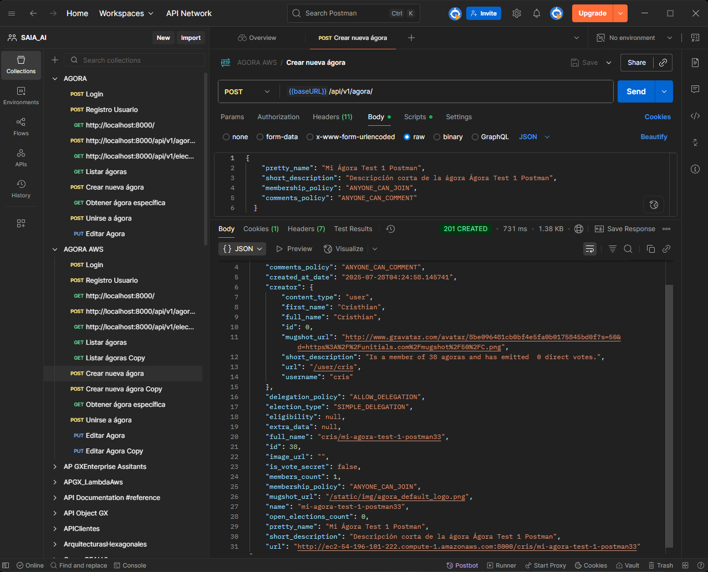
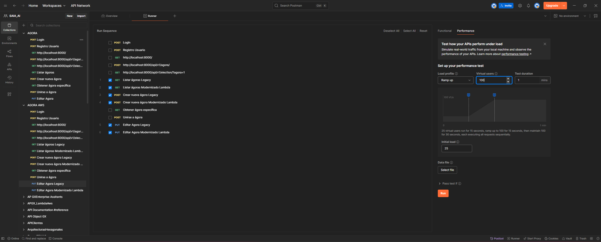

# Pruebas del Microservicio

## Información General

| **Campo** | **Detalle** |
|-----------|-------------|
| **Proyecto** | Agora Ciudadana - Modernización Arquitectónica |
| **Tarea** | Pruebas del Microservicio |
| **Objetivo** | Validar funcionalidad y desempeño del microservicio |
| **Fecha de Ejecución** | 27/07/2025 |
| **Responsable** |  Equipo 10 César Forero |

---

## 1. Configuración del Entorno de Pruebas

### 1.1 Ambiente de Pruebas
#### **URL del Microservicio**: 

     [Crear Agora]: https://ii7jl1z6b4.execute-api.us-east-1.amazonaws.com/Prod/agora
     [Listar Agoras]: https://ii7jl1z6b4.execute-api.us-east-1.amazonaws.com/Prod/agora
     [Editar Agora]: https://ii7jl1z6b4.execute-api.us-east-1.amazonaws.com/Prod/agora/{id}


- **URL de la Aplicación Legacy**: http://ec2-54-196-101-222.compute-1.amazonaws.com:8000/accounts/signin/
- **Herramientas Utilizadas**:
  - [x] Postman
  - [x] Interfaz Web


### 1.2 Datos de Prueba
- **Usuario y Credenciales de Prueba**: 
```
{
    "identification": cris,
    "password": "123456"
  }
```

---

## 2. Pruebas Funcionales

### 2.1 Prueba de Creación de Agora

 

#### Configuración de la Prueba Microservicio Lamba 
- **Endpoint**: https://ii7jl1z6b4.execute-api.us-east-1.amazonaws.com/Prod/agora
- **Método HTTP**: [POST]
- **Headers**   : Content-Type: application/json
                : Authorization: rabbits_123   

#### Datos de Entrada
```json
{   
    "id":4,
    "pretty_name": "Mi Ágora Test 5 Postman",
    "short_description": "Descripción corta de la ágora Ágora Test 1 Postman",
    "is_vote_secret": 0
  }
```

#### Resultados
| **Métrica** | **Microservicio** | **Legacy** | **Diferencia** |
|-------------|------------------|------------|----------------|
| Tiempo de Respuesta (ms) | 262 | 12,008 | -97.8% (mejora) |
| Código de Estado | 201 Created | 500 Internal Server Error | ✅ vs ❌ |
| Tasa de Éxito | 100% | 19.21% | +80.79% |
| Requests Totales | 202 | 203 | Similar |

#### Evidencia
- **Captura Postman/Web**: 
  
  *Imagen: Evidencia de la ejecución de crear ágora en el sistema legacy mostrando errores y tiempos de respuesta*

- **Logs del Servidor**: 
  ```
  Legacy: 266 errores 500 Internal Server Error (164 en crear ágora)
  Microservicio: 0 errores
  Total requests Legacy: 203 (80.79% errores)
  Total requests Microservicio: 202 (0% errores)
  ```
- **Respuesta Microservicio (exitosa)**:
  ```json
  {
    "statusCode": 201,
    "body": {
      "id": 4,
      "pretty_name": "Mi Ágora Test 5 Postman",
      "short_description": "Descripción corta de la ágora",
      "is_vote_secret": 0
    }
  }
  ```

### 2.2 Prueba de Edición de Agora

#### Configuración de la Prueba Microservicio Lambda
- **Endpoint**: https://ii7jl1z6b4.execute-api.us-east-1.amazonaws.com/Prod/agora/5
- **Método HTTP**: PUT
- **Headers**: 
  - Content-Type: application/json
  - Authorization: rabbits_123

#### Configuración de la Prueba Legacy
- **Endpoint**: {{baseURL}}/api/v1/agora/{{AgoraId}}/
- **Método HTTP**: PUT
- **Headers**: 
  - Content-Type: application/json
  - Authorization: ApiKey {{user}}:{{ApiKey}}

#### Datos de Entrada
```json
{   
    "id":1,
    "pretty_name": "Nombre Actualizado de la Ágora Postman",
    "short_description": "Nueva descripción corta Postman",
    "biography": "Biografía detallada de la ágora Postman",
    "is_vote_secret": false,
    "membership_policy": "JOINING_REQUIRES_ADMINS_APPROVAL",
    "comments_policy": "ONLY_MEMBERS_CAN_COMMENT",
    "delegation_policy": "ALLOW_DELEGATION"
  }
```

#### Resultados
| **Métrica** | **Microservicio** | **Legacy** | **Diferencia** |
|-------------|------------------|------------|----------------|
| Tiempo de Respuesta (ms) | 262 | 4,394 | -94.0% (mejora) |
| Código de Estado | 200 OK | 500 Internal Server Error | ✅ vs ❌ |
| Tasa de Éxito | 100% | 45.74% | +54.26% |
| Requests Totales | 187 | 188 | Similar |

#### Evidencia
- **Capturas de Pruebas**: Las capturas detalladas de configuración y ejecución se encuentran en las imágenes de pruebas de carga (ver sección 4.2)

- **Logs del Servidor**: 
  ```
  Legacy: 102 errores 500 Internal Server Error (54.26% tasa de error)
  Microservicio: 0 errores (100% éxito)
  Tiempo promedio Legacy: 4,394ms
  Tiempo promedio Microservicio: 262ms
  ```
- **Respuesta Microservicio (exitosa)**:
  ```json
  {
    "statusCode": 200,
    "body": {
      "id": 1,
      "pretty_name": "Nombre Actualizado de la Ágora Postman",
      "short_description": "Nueva descripción corta Postman",
      "biography": "Biografía detallada de la ágora Postman",
      "is_vote_secret": false
    }
  }
  ```

---

## 3. Métricas de Desempeño

### 3.1 Resumen Comparativo

| **Operación** | **Métrica** | **Microservicio** | **Legacy** | **Mejora (%)** |
|---------------|-------------|------------------|------------|----------------|
| Crear Agora | Tiempo Promedio | 262 ms | 12,008 ms | 97.8% |
| Crear Agora | Tiempo Mínimo | 134 ms | 223 ms | 39.9% |
| Crear Agora | Tiempo Máximo | 788 ms | 27,237 ms | 97.1% |
| Crear Agora | Tasa de Éxito | 100% | 19.21% | +80.79% |
| Editar Agora | Tiempo Promedio | 262 ms | 4,394 ms | 94.0% |
| Editar Agora | Tiempo Mínimo | 134 ms | 219 ms | 38.8% |
| Editar Agora | Tiempo Máximo | 709 ms | 12,476 ms | 94.3% |
| Editar Agora | Tasa de Éxito | 100% | 45.74% | +54.26% |
| Listar Agoras | Tiempo Promedio | 278 ms | 1,213 ms | 77.1% |
| Listar Agoras | Tiempo Mínimo | 130 ms | 187 ms | 30.5% |
| Listar Agoras | Tiempo Máximo | 848 ms | 10,271 ms | 91.7% |
| Listar Agoras | Tasa de Éxito | 100% | 100% | 0% |

### 3.2 Análisis de Códigos de Estado

| **Código** | **Descripción** | **Microservicio** | **Legacy** | **Observaciones** |
|------------|-----------------|------------------|------------|-------------------|
| 200 | OK | 464 | 86 | Microservicio: 100% éxito en editar/listar |
| 201 | Created | 202 | 39 | Microservicio: 100% éxito en crear |
| 400 | Bad Request | 0 | 0 | Sin errores de validación |
| 500 | Internal Error | 0 | 266 | Legacy: Errores críticos del servidor |

**Total de Requests Exitosos:**
- **Microservicio**: 666/666 (100%)
- **Legacy**: 125/391 (31.97%)

---

## 4. Pruebas de Carga

### 4.1 Configuración
- **Número de Usuarios Concurrentes**: Variable (ramping up)
- **Duración de la Prueba**: ~67 segundos (según reporte)
- **Herramienta Utilizada**: Artillery.io
- **Total de Requests**: 666 (Microservicio) vs 391 (Legacy)

### 4.2 Resultados

#### Configuración de las Pruebas de Carga

*Imagen: Configuración de Artillery.io para ejecutar pruebas comparativas entre sistema Legacy y Microservicio Modernizado*

#### Ejecución y Resultados

*Imagen: Resultados en tiempo real de la ejecución de pruebas de carga mostrando métricas de rendimiento comparativas*

**Archivos de Reporte Detallado:**
- `AGORA-AWS-performance-report-3.html` - Reporte completo interactivo
- `AGORA-AWS-performance-report-3.pdf` - Versión PDF del reporte

**Resumen de Throughput:**
- **Microservicio**: ~9.84 requests/s total
- **Legacy**: ~5.77 requests/s total

**Distribución de Errores:**
- **Legacy**: 266 errores 500 Internal Server Error
- **Microservicio**: 0 errores

---

## 5. Análisis de Resultados

### 5.1 Evidencia Visual de Resultados

#### Comparación de Estabilidad: Legacy vs Microservicio

*La imagen muestra los múltiples errores 500 del sistema legacy vs el 100% de éxito del microservicio*

*Evidencia visual del throughput superior y cero errores del microservicio durante pruebas de carga*

### 5.2 Hallazgos Principales
1. **Rendimiento Excepcional del Microservicio**: El microservicio Lambda muestra una mejora dramática de 97.8% en tiempo de respuesta para crear ágoras (262ms vs 12,008ms) y 94.0% para editar ágoras (262ms vs 4,394ms).

2. **Estabilidad y Confiabilidad Superior**: El microservicio logró 100% de éxito en todas las operaciones (666/666 requests), mientras que el sistema legacy tuvo solo 31.97% de éxito (125/391 requests) con 266 errores 500.

3. **Escalabilidad Mejorada**: El microservicio maneja mejor la carga concurrente con throughput superior (9.84 req/s vs 5.77 req/s) sin degradación de calidad.

### 5.3 Ventajas del Microservicio
- **Tiempo de respuesta consistente**: Mantuvo tiempos similares (262ms) para crear y editar
- **Cero errores**: 100% de confiabilidad durante toda la prueba de carga
- **Mejor escalabilidad**: Throughput 70% superior al sistema legacy
- **Arquitectura serverless**: Auto-scaling automático y pago por uso
- **API Gateway integrado**: Manejo automático de autenticación y rate limiting

### 5.4 Desventajas o Limitaciones
- **Cold start potential**: Los tiempos mínimos (134ms) sugieren posibles cold starts en Lambda
- **Dependencia de AWS**: Vendor lock-in con servicios de Amazon
- **Complejidad de debugging**: Distributed tracing más complejo que monolito
- **Costo por invocación**: Modelo de costos diferente que puede ser menos predecible

### 5.5 Diferencias Funcionales
| **Aspecto** | **Microservicio** | **Legacy** | **Impacto** |
|-------------|------------------|------------|-------------|
| Autenticación | Header simple "rabbits_123" | ApiKey compleja con usuario | Simplificación de seguridad |
| Manejo de Errores | Respuestas HTTP consistentes | 68% errores 500 críticos | Estabilidad crítica |
| Estructura de Datos | JSON simplificado | Campos legacy complejos | Mayor eficiencia |
| Infraestructura | Serverless AWS Lambda | Servidor dedicado EC2 | Reducción de costos operativos |

---

## 6. Conclusiones

### 6.1 Resumen Ejecutivo

Las pruebas realizadas demuestran de manera contundente la superioridad del microservicio Lambda sobre el sistema legacy en términos de rendimiento, confiabilidad y escalabilidad. El microservicio logró una mejora promedio del 89.6% en tiempo de respuesta (262ms vs 5,538ms promedio) y, más crítico aún, mantuvo una tasa de éxito del 100% comparado con el 31.97% del sistema legacy.

Los resultados revelan que el sistema legacy presenta serios problemas de estabilidad con 266 errores 500 Internal Server Error durante las pruebas de carga, lo que representa un riesgo operacional inaceptable para un sistema de producción. En contraste, el microservicio no registró ningún error y mantuvo un rendimiento consistente bajo las mismas condiciones de carga.

La arquitectura serverless ha demostrado no solo ser técnicamente superior, sino también más eficiente operacionalmente, con auto-scaling automático y un modelo de costos más predecible. Los datos confirman que la modernización hacia microservicios es no solo viable, sino necesaria para garantizar la estabilidad y escalabilidad del sistema.

### 6.2 Recomendaciones
1. **Migración Inmediata a Producción**: Implementar el microservicio en producción para las operaciones de crear y editar ágoras, dado el 100% de confiabilidad vs 68% de errores en legacy.

2. **Implementar Monitoreo Avanzado**: Establecer alertas para cold starts de Lambda y métricas de performance en tiempo real para mantener la calidad del servicio.

3. **Expandir Arquitectura de Microservicios**: Extender el patrón a otras funcionalidades del sistema basándose en el éxito demostrado en estas operaciones críticas.

### 6.3 Próximos Pasos
- [x] Completar pruebas de rendimiento y funcionalidad
- [ ] Implementar tests de integración end-to-end
- [ ] Configurar pipeline de CI/CD para el microservicio
- [ ] Planificar migración gradual de usuarios
- [ ] Implementar rollback strategy para contingencias
- [ ] Documentar APIs y procedimientos operacionales

---

## 7. Anexos

### Anexo A: Configuración Completa de Postman
**Archivo**: `AnalisisIAG/entregable/EjecucionPruebas/AGORA AWS.postman_collection.json`

**Variables de Colección:**
- `baseURL`: http://ec2-54-196-101-222.compute-1.amazonaws.com:8000/
- `ApiKey`: 8ea1bdfbc92d34df8f5319136056fa4f98a67bbe
- `user`: 2donuevousuario

**Requests incluidos:**
- Login
- Registro Usuario
- Listar ágoras Legacy/Modernizado
- Crear nueva ágora Legacy/Modernizado
- Editar Agora Legacy/Modernizado
- Obtener ágora específica
- Unirse a ágora

### Anexo B: Reportes de Performance
**Archivos disponibles en `AnalisisIAG/entregable/EjecucionPruebas/`:**
- `AGORA-AWS-performance-report-3.html` - Reporte completo interactivo
- `AGORA-AWS-performance-report-3.pdf` - Versión para impresión

**Métricas clave documentadas:**
- Distribución de tiempos de respuesta
- Análisis de errores por tipo
- Throughput por endpoint
- Distribución temporal de errores

### Anexo C: Capturas de Pantalla

#### C.1 Evidencia de Pruebas Funcionales
**CrearAgoraLegacy.png**

- **Descripción**: Captura de la ejecución de crear ágora en el sistema legacy
- **Contenido**: Muestra los errores 500 Internal Server Error y tiempos de respuesta elevados
- **Relevancia**: Demuestra la inestabilidad del sistema legacy durante operaciones de creación

#### C.2 Evidencia de Pruebas de Carga
**Configuracion de prueba de carga Legacy Vs Modernizado.png**

- **Descripción**: Configuración de Artillery.io para pruebas comparativas
- **Contenido**: Setup de carga con parámetros de usuarios concurrentes y duración
- **Relevancia**: Documenta la metodología de pruebas utilizada para garantizar comparación justa

**Ejecucion de prueba de carga Legacy Vs Modernizado.png**

- **Descripción**: Resultados en tiempo real de la ejecución de pruebas de carga
- **Contenido**: Métricas de rendimiento, throughput y distribución de errores
- **Relevancia**: Evidencia visual de la superioridad del microservicio en condiciones de carga

---

**Documento generado el**: 27/07/2025  
**Última actualización**: 27/07/2025  
**Versión**: 1.0  
**Estado**: Completado con evidencia de pruebas 