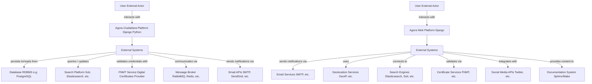
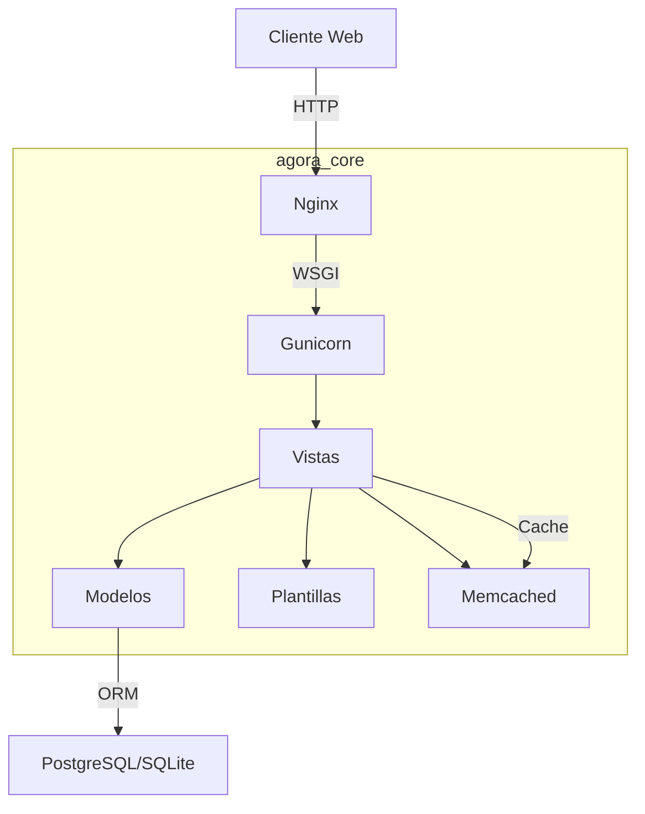

# Proyecto de Modernización de Software - Semana 2

## Equipo 10
- Julio César Forero Orjuela
- Juan Fernando Copete Mutis
- Jorge Iván Puyo
- Cristhian Camilo Delgado Pazos

## 1 Motivación de la modernización

Ágora Ciudadana, plataforma de democracia líquida, fue construida con Python 2.7 y Django 1.5.5 (fin de vida en 2020). Esto genera vulnerabilidades de seguridad, altos costos de mantenimiento y una arquitectura monolítica difícil de escalar. El objetivo es modernizar Parte del software y sus funcionalidades, no sólo migrar infraestructura, para:

1. Permitir despliegues continuos mediante contenedores (Docker/Kubernetes).
2. Experimentar con funcionalidades que permitan implementar arquitecturas basadas en microservicios y despliegue en AWS.
3. Facilitar la contribución de nuevos desarrolladores eliminando dependencias obsoletas.
4. Habilitar escalabilidad horizontal y resiliencia.

## 2 Entendimiento del legado

### 2.1 Tecnología legada

| Categoría               | Detalles                                                                                                                                   |
| ----------------------- | ------------------------------------------------------------------------------------------------------------------------------------------ |
| Lenguaje / Framework    | Python 2.7 (EOL) / Django 1.5.5                                                                                                            |
| Patrón arquitectónico   | MVT (Model-View-Template) (geeksforgeeks.org) |
| Paquetes clave          | userena, haystack (Whoosh), actstream                                                                                                      |
| Infraestructura         | Nginx → Gunicorn (WSGI) → Aplicación; despliegue bare-metal/VPS                                                                            |
| Base de datos           | SQLITE / PostgreSQL                                                                                                                        |
| Caché                   | Memcached                                                                                                                                  |
| Gestión de dependencias | requirements.txt                                                                                                                           |

Principales características y limitaciones:

- Dependencias sin soporte oficial → riesgo de seguridad.

---

• Monolito dificulta la incorporación de microservicios y pruebas
  independientes.
• Despliegues manuales, sin CI/CD.
• Escalabilidad sólo vertical.

## 2.2 Arquitectura de la tecnología legada

### Modelo de 3 capas de la aplicación

---

La arquitectura MVT separa datos, lógica y presentación, pero en versiones antiguas de Django todo reside en un mismo repositorio y proceso. Su flujo estándar es:

Descripción de elementos:

- Modelos: mapeo ORM entre objetos Python y tablas PostgreSQL/SQLite.
- Vistas: funciones/clases que orquestan la lógica de negocio y devuelven _responses_.
- Plantillas: archivos HTML con _tags_ de Django renderizados en servidor.
- WSGI: interfaz que conecta servidores (Gunicorn) con Django.

---

Aunque MVT facilita pruebas unitarias, la ausencia de una capa de servicios independiente hace que la lógica de dominio se combine con controladores, incrementando el acoplamiento.

## 3 Aplicación de ejemplo

| Aspecto                     | Información                                                                                                                                                                                                  |
| --------------------------- | ------------------------------------------------------------------------------------------------------------------------------------------------------------------------------------------------------------ |
| Nombre                      | Ágora Ciudadana                                                                                                                                                                                              |
| Repositorio                 | <https://github.com/agoravoting/agora-ciudadana>                                                                                                                                                             |
| Tamaño                      | ≈ 31 k líneas de código (contando .py, .js, .html)                                                                                                                                                       |
| Dominio                     | Democracia líquida, procesos de votación ciudadana                                                                                                                                                           |
| Funcionalidades principales | • Gestión de usuarios y delegación de voto • Creación de ágoras y procesos electorales • Publicación de propuestas y candidaturas • API REST básica • Historial de actividades (audit trail) |

Cobertura de requisitos del curso

* ☼ > 2000 líneas.
* Compila y se ejecuta; funcionalidad comprobada con ./runtests.sh.
* Repositorio público;

### Repositorio

Original:
agoravoting/agora-ciudadana: Liquid Voting system made with python and django

Fork:
JulioCesarForero/agora-ciudadana: Liquid Voting system made with python and django

Ejecución: el repositorio incluye un script provision/docker-compose.yml que permite levantar los servicios en contenedores (PostgreSQL, RabbitMQ, Celery, Django). Las instrucciones se verificaron en Ubuntu 22.04 con Docker 24.0.

---

# Declaración de uso de IAG

# Uso de Inteligencia Artificial Generativa (IAG)

Para todas las actividades evaluativas (excepto el examen final) se permite el uso de herramientas de IAG. Si se usan se debe incluir en el entregable una sección en donde se respondan las siguientes preguntas:

- ¿Se hizo uso de IAG? SI
- ¿Qué herramientas de IAG se usaron? Notebooklm, OpenIA, CloudSonet
- ¿En qué partes del entregable se usó la IAG? Se hace uso de la la herramienta como forma de estudio para interpretar, entender, estudiar y repasar el material de estudio. Particularmente en el entregable la usé para construir las respuestas de similitudes y diferencias.
- ¿Qué calidad tenían los resultados de la IAG? Buena
- ¿Los resultados de la IAG se integraron sin modificación o los estudiantes debieron intervenirlos? Siempre se corroboran y ajustan las respuestas que brindan los modelos y herramientas de IAG buscando combinar las respuestas que da junto con el propio conocimiento, entendimiento y experiencia, debatiendo con el equipo y agregando contenido o eliminándolo según lo considerado como verdadero y que podamos sustentar.

---

